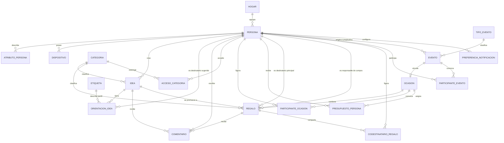
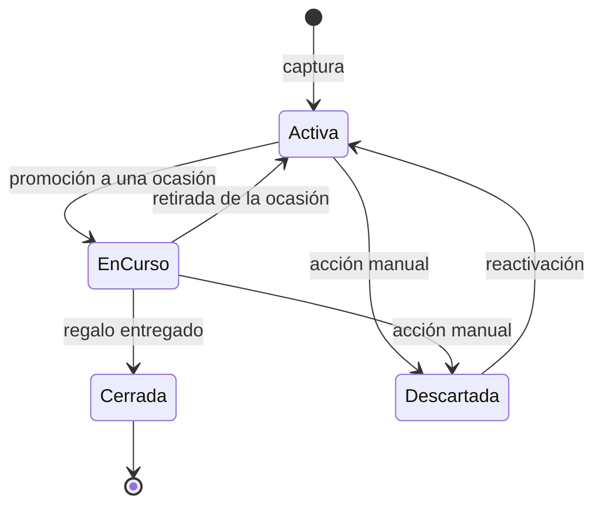
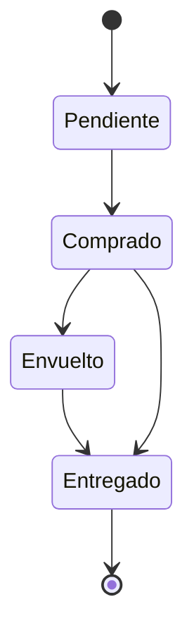
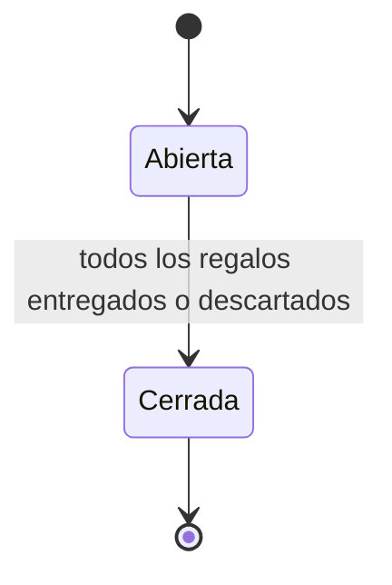
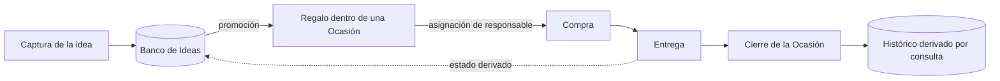
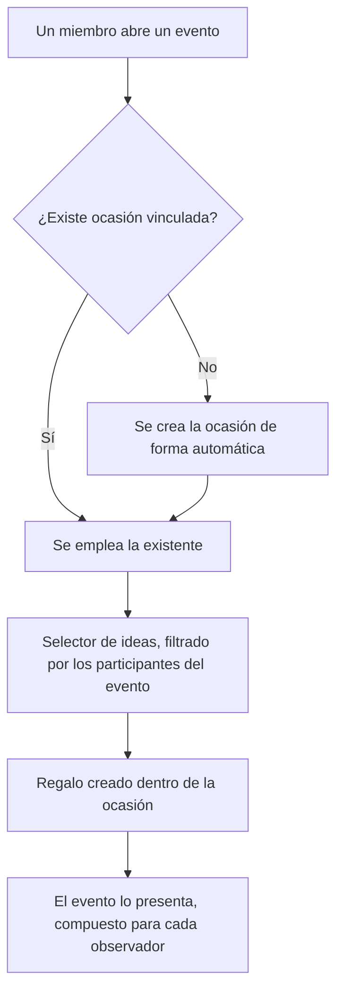
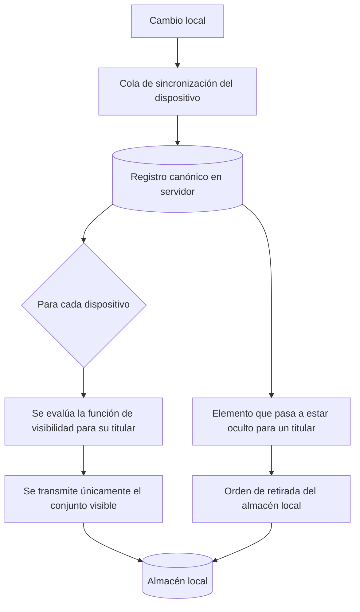

# Agenda Familiar — Modelo de Datos y Flujos

**Versión:** 0.4
**Fecha:** 24 de julio de 2026
**Documento complementario de:** Agenda Familiar — Especificación Funcional
**Alcance:** entidades, relaciones, ciclos de estado y flujos de información. El módulo Anecdotario, aunque forma parte del alcance de la primera versión, se modelará cuando se cierre su especificación funcional.

---

## 1. Convenciones

**Identificadores.** Todas las entidades emplean identificadores generados en el propio dispositivo. El requisito de funcionamiento sin conexión obliga a que un usuario pueda crear registros sin red, y por tanto sin poder solicitarlos al servidor. La generación local elimina las colisiones en la posterior sincronización.

**Campos comunes.** Toda entidad de contenido incorpora fecha de creación, fecha de última modificación y autor. Son automáticos y no editables, y sostienen tanto la trazabilidad como la resolución de conflictos.

**Borrado.** No se elimina información de forma física. Las entidades se marcan como inactivas, lo que permite reconstruir el histórico y resolver la sincronización tardía de un dispositivo que llevaba tiempo sin conectarse. La retención es indefinida.

**Imágenes.** La primera versión no contempla almacenamiento de archivos. La entidad Adjunto queda prevista pero no se implementa, y los avatares de persona se generan a partir de las iniciales.

---

## 2. Entidades

### 2.1 Núcleo de personas

**Persona.** Registro único de todo aquel que participa en un evento o recibe un regalo.

| Campo | Notas |
|---|---|
| id | |
| nombre, apellidos | |
| fecha_nacimiento | Origen de los cumpleaños automáticos |
| parentesco | Descriptivo |
| tiene_cuenta | Determina si le aplican las reglas de ocultación |
| identificador_apple | Nulo si no tiene cuenta |
| rol | administrador, miembro, o nulo si no tiene cuenta |
| circulo | familia, extendida o amigos. Es lo que ordena la pantalla de personas |
| genero | f o m, o nulo. Solo para nombrar bien; véase abajo |
| activa | La independencia de una hija no altera este campo |

**Género.** Existe solo para afinar cómo se nombra a cada uno: elegir entre «mamá» y «papá», o entre «hermana» y «hermano», cuando la palabra del parentesco no lleva el género dentro —«lóver»—. La aplicación no saca nada más de él, y por eso admite nulo: sin dato, la palabra se deduce del propio parentesco.

**Círculo.** El vínculo, que es cosa distinta de tener cuenta: la abuela no tiene y es de la familia; un amigo podría tenerla sin serlo. Toma tres valores cerrados y cada persona pertenece a uno solo. Al migrar, quien tenía cuenta pasa a `familia` y el resto a `extendida`, que es también el valor por defecto: equivocarse hacia fuera se corrige desde una ficha, mientras que equivocarse hacia dentro rompe la regla de los cuatro en cuanto entra la quinta persona.

**AtributoPersona.** Pares de clave y valor: talla de calzado, alergias, aficiones. Las claves son de creación libre, y la interfaz sugiere las ya utilizadas en el hogar. Se modela como entidad separada y no como campos fijos porque el conjunto de atributos útiles difiere mucho entre una hija y un sobrino, y crece de forma imprevisible.

No existe entidad de histórico de regalos. Se deriva por consulta sobre los regalos de las ocasiones cerradas, lo que elimina toda posibilidad de divergencia con el dato de origen.

### 2.2 Clasificación y visibilidad

**Categoría.** Nombre, regla de visibilidad —pública, restringida o privada— y orden de presentación.

**AccesoCategoría.** Relación entre categoría y persona. Solo tiene contenido para las categorías restringidas, que no forman parte del catálogo inicial.

**Etiqueta.** Descriptor libre empleado en la orientación de ideas. No identifica a nadie y, en consecuencia, no activa ocultación alguna. Admite fusión por parte de un administrador, operación que reasigna todas las referencias de la etiqueta absorbida y la marca como inactiva.

### 2.3 Ideas y deseos

**Idea.** Unidad del banco permanente.

| Campo | Notas |
|---|---|
| id | |
| tipo | sugerencia o deseo |
| título | Obligatorio en la captura |
| descripción | Exigible al promover, no al capturar |
| categoría_id | |
| precio_min, precio_max | Orientativos |
| enlace, establecimiento | |
| estado | activa, en_curso, cerrada, descartada |
| autor_id, fecha_creación, fecha_modificación | Automáticos |

El deseo no constituye una entidad separada, sino un valor del campo `tipo`. Su forma es idéntica a la de una sugerencia y admite igualmente la promoción a regalo; lo que cambia es su tratamiento en la función de visibilidad, que nunca lo oculta a su autor. Mantener una única entidad evita duplicar la lógica de promoción, comentarios y estados. El deseo no incorpora campo de prioridad.

**OrientaciónIdea.** Relación que expresa el "para quién". Cada fila referencia una persona o una etiqueta, nunca ambas. Una idea admite varias filas, que pueden mezclar los dos tipos.

**Comentario.** Texto, autor y fecha, sobre un objeto referenciado mediante tipo y ubicación. Los tipos admitidos son idea, regalo y evento.

### 2.4 Agenda

**TipoEvento.** Catálogo configurable. Contenido inicial: cumpleaños, santo, aniversario, viaje, competición, entreno, celebración, fecha escolar, cita médica y otro. Cada tipo lleva asociados un emoji por defecto y un indicador de si los eventos de ese tipo suelen llevar regalos, que fija el valor propuesto en el formulario.

**Evento.** Título, tipo, emoji propio opcional que sustituye al del tipo, fechas de inicio y fin, indicador de jornada completa, ubicación, notas, regla de recurrencia —sin repetición, semanal, mensual o anual, con fecha de fin opcional—, indicador de si lleva regalos, categoría opcional para los eventos que son en sí una sorpresa, y origen.

**Origen del evento.** Toma tres valores: manual, derivado —con referencia a la persona de cuya fecha de nacimiento procede— e importado, con referencia al calendario externo de procedencia. Los dos últimos no admiten edición del contenido; sí del emoji, de la asociación de regalos y de los avisos, que son datos propios de esta aplicación.

**CalendarioExterno.** Nombre, identificador de la fuente, tipo de evento que se asigna por defecto a lo que llegue de ella, y marca de última sincronización.

**ParticipanteEvento.** Relación entre evento y persona, con un rol que distingue al protagonista del resto. La distinción es funcional: el protagonista determina el filtro por defecto del selector de regalos.

**PreferenciaNotificación.** Por persona y evento o tipo de evento. Por defecto solo está activo el recordatorio previo; los avisos de modificación quedan desactivados, lo que además reduce la superficie de filtración descrita en el apartado 3.5 de la especificación funcional.

### 2.5 Ocasiones y regalos

**Ocasión.** Nombre, fecha, estado —abierta o cerrada— y vínculo opcional con un evento de la agenda mediante un `evento_id` opcional. El vínculo reside en la Ocasión, no en el Evento: así, la creación automática de la ocasión al asociar el primer regalo desde un evento no obliga a modificar el evento, que permanece ajeno a la maquinaria de regalos. No incorpora importe global: el total se obtiene por suma de los presupuestos individuales.

**ParticipanteOcasión.** Relación entre ocasión y persona destinataria. Es la relación que se copia al duplicar una ocasión del año anterior; ni los presupuestos ni los regalos se trasladan.

**PresupuestoPersona.** Ocasión, persona e importe previsto. El gasto real correspondiente se deriva por suma de los costes registrados en sus regalos.

**Regalo.**

| Campo | Notas |
|---|---|
| id | |
| ocasion_id | |
| idea_id | Nulo si se creó directamente |
| destinatario_principal_id | Determina en qué lista aparece |
| compartido | Indicador |
| responsable_id | Persona con cuenta |
| coste_real | Opcional |
| estado | pendiente, comprado, envuelto, entregado |
| categoria_id | Heredada de la idea salvo modificación |

**CoDestinatarioRegalo.** Personas adicionales implicadas en un regalo compartido. La ocultación alcanza al destinatario principal y a todas ellas.

**Adjunto.** Previsto para etapas posteriores. Sin implementación en la primera versión.

### 2.6 Operación

**Dispositivo.** Vinculado a una persona con cuenta, con marca de última sincronización. Es el destinatario del filtrado descrito en el apartado 7.3.

---

## 3. Diagrama entidad-relación



---

## 4. Reglas de integridad

Una fila de orientación de idea referencia exactamente una persona o exactamente una etiqueta. Ninguna puede referenciar ambas ni quedar vacía.

Una idea de tipo deseo tiene como única orientación a su propio autor. Si un usuario introduce una idea orientada solo a sí mismo, el sistema la reclasifica como deseo al guardarla.

Un regalo tiene exactamente un destinatario principal. Los co-destinatarios solo existen cuando el indicador de compartido está activo, y ninguno de ellos puede coincidir con el principal.

Una ocasión se vincula como máximo a un evento, y un evento como máximo a una ocasión.

Un presupuesto por persona requiere que esa persona figure como participante de la ocasión.

Una persona sin cuenta no puede figurar como autor de ninguna entidad de contenido, ni como responsable de compra, ni en las listas de acceso a categorías restringidas.

El círculo `familia` admite cuatro personas activas como máximo: es el hogar, no un grupo que crece. La pantalla lo sostiene no ofreciendo por dónde añadir; la regla es la red debajo, para lo que entre por la API o por una edición a mano del registro. Dar de baja a alguien libera su hueco.

Un regalo en estado entregado no admite modificación de destinatario ni de ocasión.

Un comentario solo puede referenciar una idea, un regalo o un evento, y hereda la visibilidad del objeto referenciado.

---

## 5. Ciclos de estado

### 5.1 Idea



Las transiciones hacia En curso y hacia Cerrada se derivan de lo que ocurre en la ocasión vinculada. Solo el descarte y la reactivación son manuales.

### 5.2 Regalo



El registro del coste real es opcional en cualquiera de las transiciones.

### 5.3 Ocasión



---

## 6. Función de visibilidad

Es la pieza central del modelo y conviene expresarla de forma explícita, porque toda consulta del sistema la atraviesa.

```
visible(elemento, observador):
    si observador.tiene_cuenta = falso
        devolver falso

    si elemento.tipo = deseo y elemento.autor = observador
        devolver verdadero

    categoría = categoría_de(elemento)
    si categoría.regla = privada y observador.rol ≠ administrador
        devolver falso
    si categoría.regla = restringida y observador ∉ acceso(categoría)
        devolver falso

    si observador ∈ destinatarios(elemento)
        devolver falso

    devolver verdadero
```

El conjunto `destinatarios` se resuelve de forma distinta según el objeto:

- Para una **idea**, las personas con cuenta que figuran en su orientación. Las etiquetas se ignoran.
- Para un **regalo**, su destinatario principal más todos sus co-destinatarios.

Los comentarios no evalúan la función por sí mismos: heredan el resultado del objeto al que pertenecen.

El orden de las comprobaciones importa. La cláusula del deseo precede a la del destinatario, porque de lo contrario una persona dejaría de ver su propia lista de deseos en el instante de crearla.

La búsqueda global sobre Ideas y Ocasiones aplica esta misma función a cada resultado antes de mostrarlo, al igual que todo contador o sumatorio.

---

## 7. Flujos de datos

### 7.1 Recorrido principal de una idea



La línea discontinua señala la retroalimentación que evita el mantenimiento manual: la entrega del regalo cierra la idea de origen sin que nadie la actualice. El histórico no se almacena, se consulta.

### 7.2 Asociación de regalos desde un evento



El filtro por participantes es una comodidad de uso y no restringe la selección. La protección corresponde por completo a la función de visibilidad.

### 7.3 Sincronización y filtrado



Es el flujo de mayor exigencia del sistema. El filtrado se produce antes de la transmisión, nunca en la presentación. Un dispositivo no debe llegar a almacenar aquello que su titular no puede ver, porque en un modelo sin conexión esa información permanecería accesible por otras vías.

La rama inferior cubre la retirada retroactiva: cuando alguien pasa a ser destinatario de un elemento que ya tenía sincronizado, la siguiente conexión debe eliminarlo de su almacén local.

La resolución de conflictos opera por campo, con criterio de última escritura, salvo en responsable de compra y estado del regalo, donde se conserva la versión descartada para revisión.

### 7.4 Generación de cumpleaños

La fecha de nacimiento del registro de Personas genera un evento recurrente anual, marcado como automático y con referencia a su persona de origen. Estos eventos no se editan directamente: se modifican corrigiendo la fecha en la ficha de la persona, lo que evita la divergencia entre el dato maestro y su reflejo en la agenda.

### 7.5 Duplicación de una ocasión

Al crear una ocasión a partir de otra anterior se copian únicamente las filas de participantes. Los presupuestos y los regalos no se trasladan: los importes del año pasado constituyen una referencia que induce a repetir sin revisar.

### 7.6 Composición del bloque de regalos de un evento

Para un observador dado, el bloque se construye tomando los regalos de la ocasión vinculada y aplicando la función de visibilidad a cada uno. Sobre el propio evento, y con independencia del resultado, se presenta además el aviso genérico, que debe generarse en el dispositivo a partir de una condición estática y nunca de un recuento recibido del servidor.

---

## 8. Decisiones de modelado pendientes

1. Modelar el Anecdotario cuando se cierre su especificación funcional, incluida la estructura de la importación desde el export de Facebook.
2. Definir el mecanismo de propagación de la fusión de etiquetas a los dispositivos que estuvieran sin conexión en el momento de ejecutarse.
