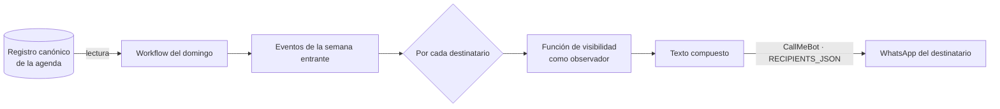

# Plan Semanal por WhatsApp — Especificación Funcional

**Versión:** 0.2
**Fecha:** 24 de julio de 2026
**Documentos complementarios:** Despachador de mensajes de WhatsApp con GitHub Actions · Agenda Familiar — Especificación Funcional · Agenda Familiar — Modelo de Datos y Flujos
**Alcance:** el envío automático, cada domingo, de un resumen de la semana entrante al grupo familiar de WhatsApp. Este documento define **qué** se envía, con **qué reglas** y **de dónde** procede el contenido. La infraestructura de despacho —cola, workflow, CallMeBot— se especifica en el documento del despachador y aquí se da por conocida. La forma concreta de acoplamiento con esa infraestructura queda como decisión abierta y se trata, sin cerrarse, en el apartado 9.

---

## 1. Propósito

La Agenda Familiar es un sistema de consulta: alguien abre la aplicación y ve lo que viene. Cubre bien la pregunta formulada, pero no la que nadie formula. Buena parte del valor de una agenda compartida no está en poder consultarla, sino en que llegue sin pedirla.

Este documento especifica ese complemento: un único mensaje semanal, enviado el domingo al grupo de WhatsApp de la familia, con el plan de los siete días siguientes. No sustituye a la aplicación ni compite con ella. La aplicación es el registro completo y editable; el mensaje es un vistazo pasivo que se recibe con el teléfono en la mano un domingo por la tarde, sin abrir nada.

El principio rector es de asimetría deliberada: **la aplicación tira, el mensaje empuja.** Quien quiera el detalle abre la agenda; quien solo quiera saber si hay algo el sábado lo lee en la notificación. Un canal que la mayoría de la familia ya mira a diario hace el trabajo que una aplicación, por buena que sea, no puede hacer: aparecer sin ser invocada.

---

## 2. Encaje en el conjunto

Tres piezas, con responsabilidades separadas:

| Pieza | Responsabilidad |
|---|---|
| Agenda Familiar (app iOS) | Registro canónico de eventos. Se consulta y se edita. |
| Este documento | Define el resumen semanal: qué contiene y qué reglas lo gobiernan. |
| Despachador de WhatsApp | Transporte. Entrega el mensaje al grupo vía CallMeBot. |

El plan semanal es, en esencia, una **vista de la agenda expresada como texto y entregada por un canal distinto**. No introduce datos nuevos: los eventos ya existen en la agenda. Introduce un momento —el domingo— y un formato —un mensaje plano—, y sobre todo introduce una regla de recorte que no existía mientras el contenido vivía dentro de la aplicación, y que constituye el núcleo de este documento (apartado 5).

---

## 3. Cadencia y momento

**El domingo por la tarde.** La semana es la unidad real de la vida familiar, y el domingo es el momento en que esa unidad se piensa: qué hay de lunes a domingo, quién tiene entreno, si el sábado hay torneo, si toca comida con los abuelos. Enviar el plan antes de ese momento lo desperdicia; enviarlo después llega tarde para organizarse.

La ventana de «tarde del domingo» es suficiente. Igual que en el resto del sistema, no se busca precisión al minuto: un mensaje que llega a las 18:00 o a las 18:40 cumple idéntica función. Esto encaja con las restricciones de puntualidad del despachador, que sondea y despacha lo vencido en lugar de disparar a una hora exacta.

**La semana que se describe es la entrante**, de lunes a domingo, no la que termina esa misma noche. El domingo por la tarde el interés está por completo en lo que viene.

**Zona horaria `Europe/Madrid`**, con resolución automática del horario de verano, en coherencia con el despachador.

---

## 4. Origen del contenido

El contenido procede de una única fuente: los eventos de la Agenda Familiar cuya fecha cae dentro de la semana entrante. Esa fuente es el registro canónico de la agenda, que se lee en el momento del envío (apartado 9); el almacenamiento concreto se decide por separado. No hay composición manual ni edición previa; el mensaje es un derivado mecánico del estado de la agenda en el instante de generarse.

Se incluyen los eventos de cualquier origen —manual, derivado o importado— sin distinción, porque para el lector la procedencia es irrelevante: un cumpleaños generado a partir de una fecha de nacimiento y una cita creada a mano son, en el plan, la misma clase de línea.

De cada evento, el mensaje toma únicamente su **cara pública**: día, hora si la tiene, título, emoji del tipo y, cuando aporta, las personas implicadas. No toma nada más. En particular, no toma absolutamente nada de la dimensión de regalos —ocasión vinculada, destinatario, presupuesto, estado de compra—, que en este canal no existe.

---

## 5. Composición por destinatario y visibilidad — consideración crítica

Es el apartado que justifica que este resumen merezca un documento propio y no una nota al pie en el del despachador. Un error aquí no produce un fallo visible: **arruina una sorpresa**, que es el modo de fallo grave de todo el sistema.

**El canal admite un mensaje por persona.** El despachador no reparte una difusión compartida: entrega a cada destinatario de forma individual, con su propio teléfono y su propia clave de CallMeBot. Nada obliga a que el texto sea el mismo para todos. Por tanto el plan **se compone por destinatario**, exactamente igual que la vista de semana se compone para cada dispositivo dentro de la aplicación. La restricción que en un primer análisis parecía inherente al canal —un único mensaje para todos— no existe.

**La regla.** Para cada destinatario, el generador construye su plan aplicando la misma función de visibilidad del sistema (modelo de datos, apartado 6) con esa persona como observador. Cada uno recibe su propia semana:

- Ana y Oscar reciben los eventos reservados a los que tienen acceso —la preparación de una celebración sorpresa, por ejemplo—, porque para ellos son visibles.
- Las hijas reciben la misma semana **sin** esos eventos: no se sustituyen por un hueco ni por una línea genérica, desaparecen, igual que desaparecen de su agenda en la aplicación. Su sola presencia, aun sin detalle, sería información.
- Los cumpleaños y demás eventos públicos llegan a todos, incluida la persona que cumple años: un cumpleaños no es un secreto. Lo que nunca entra en el canal es la dimensión de regalos —ocasiones, destinatarios, presupuestos, estado de compra—, que vive en otro módulo y no se lee para componer el plan. La fuente del mensaje es la agenda de eventos.

**Consecuencia sobre la completitud.** Al componerse por persona, el plan de cada miembro es tan completo como su vista de semana dentro de la aplicación. No se paga el peaje de un mínimo común: nadie deja de ver algo que le corresponde para proteger a otro. La protección la ejerce la propia función de visibilidad, destinatario a destinatario.

**Dónde está ahora el riesgo.** Ya no está en la imposibilidad de componer, sino en componer bien. El texto que sale es el artefacto final: no hay una capa de presentación posterior donde filtrar. Por eso **el filtrado se produce en la generación**, nunca después, y con una cautela concreta: cada plan se renderiza para su observador y **no se reutiliza jamás un cuerpo ya compuesto para enviarlo a otra persona**. Un mensaje correcto para Ana, remitido por error a la hija, es una filtración consumada e irreversible —ya se ha entregado— sin posibilidad de retirarlo. La correspondencia entre observador y texto es el punto que la implementación debe blindar.

**Destinatarios sin cuenta.** Un abuelo que recibe el plan por WhatsApp no es un observador del modelo de la aplicación. Se le compone la **vista pública**: eventos públicos, sin dimensión de regalos y sin ningún evento reservado, ya que un evento reservado podría ser una sorpresa que le concierne a él mismo. Es la vista más conservadora, y es la adecuada para quien está fuera del círculo de coordinación.

---

## 6. Composición del mensaje

El mensaje reproduce en texto el marco fijo de siete días de la vista de semana: una fila por día, los días vacíos incluidos. La forma constante hace que la lectura sea casi automática y que los días libres informen tanto como los ocupados —enseñan la forma de la semana— en lugar de omitirse.

WhatsApp admite texto plano con saltos de línea y un marcado ligero (`*negrita*`). El generador se limita a eso; no hay tablas ni alineaciones que un cliente móvil rompería.

Esquema:

```
*Plan de la semana*
28 jul – 3 ago

L 28  🏇 Entreno de hípica · 18:00
M 29  —
X 30  —
J 31  🩺 Dentista (Ana) · 10:00
V  1  —
S  2  🎂 Cumpleaños de la abuela
D  3  🍽️ Comida con los abuelos · 14:00
```

Decisiones de formato:

- **Una línea por evento.** Emoji, título recortado, hora si la tiene. El emoji cumple aquí la misma función que en la agenda: permite reconocer un evento sin leerlo y convierte la semana en algo que se abarca de un vistazo.
- **Días vacíos con un guion.** Presentes y marcados, nunca omitidos.
- **Techo de tres eventos por día.** A partir del cuarto, una línea de resumen —«y 2 más»— en lugar de un muro de texto. El recuento de ese resumen se calcula, igual que en la aplicación, solo sobre los eventos visibles: nunca debe delatar la existencia de un evento reservado que se excluyó.
- **Sin enlaces ni identificadores.** El mensaje es de lectura, no de navegación. Quien quiera actuar abre la aplicación.
- **Emojis de tipo, no libres.** Se reutiliza la asignación por defecto de la agenda, acotada. La variedad ilimitada convertiría el mensaje en un mosaico ruidoso.

El conjunto debe caber en una pantalla de móvil sin desplazamiento en una semana normal. Es un resumen, no un boletín.

---

## 7. La semana sin eventos

La semana vacía se evalúa por destinatario: la semana de una hija puede no tener nada visible mientras la de sus padres contiene la preparación de una sorpresa. Cuando la semana entrante no tiene ningún evento visible **para un destinatario dado**, su mensaje se envía igualmente, con una línea que lo declara:

```
*Plan de la semana*
28 jul – 3 ago

Sin nada en el calendario esta semana.
```

Se envía siempre por la misma razón por la que el aviso «Por aquí no se mira» está siempre presente: la regularidad construye el hábito. Si el mensaje solo llegara las semanas con contenido, su ausencia una tarde de domingo sería ambigua —¿semana vacía o envío fallido?— y la familia dejaría de confiar en él. Un canal en el que se confía llega también para decir que no hay nada.

Hay además una razón de hermetismo, y es la que hace que enviar siempre no sea opcional. Si el plan de una hija se saltara por «no tener nada visible», su ausencia podría delatar que lo único que contenía su semana era un evento reservado que se le ocultó —la sorpresa que se prepara para ella—. Enviar siempre, también a quien esa semana no tiene nada, cierra esa vía.

---

## 8. Destinatarios

El plan se dirige al grupo familiar completo, hijas incluidas, y a los destinatarios sin cuenta que se desee —los abuelos—. El mapa de destinatarios y sus claves son los del despachador, `RECIPIENTS_JSON`.

A cada uno se le entrega **su propio texto**, compuesto según el apartado 5. Aquí reside la diferencia con un mensaje ordinario de la cola: aquel reparte un mismo `text` entre varios `to`, mientras que el plan produce un cuerpo distinto por persona. Esa asimetría condiciona la integración (apartado 9): la lista `to` compartida no sirve para el plan, porque cada destinatario no comparte contenido con los demás.

Es justamente por incluir a las hijas por lo que la regla del apartado 5 no es negociable: no se les oculta el plan, se les compone el suyo.

---

## 9. Integración con el despachador

La generación del plan no depende de ningún dispositivo: vive en un **generador de servidor de confianza**, programado para el domingo y hermano del despachador. Con independencia de dónde se almacene la agenda —cuestión que se decide por separado (apartado 12)—, su forma es:

1. **Lee** el registro canónico de la agenda desde su fuente.
2. **Selecciona** los eventos cuya fecha cae en la semana entrante.
3. Para **cada destinatario**, aplica la función de visibilidad con esa persona como observador y compone su texto (apartado 5).
4. **Envía** un mensaje individual a cada uno por CallMeBot, reutilizando el mapa `RECIPIENTS_JSON` del despachador.



**Por qué no pasa por `queue.json`.** La cola del despachador está pensada para mensajes que un humano compone y programa. El plan no es eso: es un derivado que se recalcula por persona cada domingo a partir del estado vivo de la agenda. Se reutiliza el **transporte** del despachador —el mapa de destinatarios y el envío por CallMeBot—, no su cola. Leer la fuente en el momento del envío da además la máxima frescura: un cambio en la agenda el sábado por la noche se refleja en el plan del domingo, sin nada congelado.

**La regla de visibilidad se aplica en la generación**, nunca después: el texto que sale es el artefacto final, sin capa de presentación posterior donde filtrar. Es coherente con el principio del sistema de no dejar que un dato oculto llegue siquiera a componerse en un mensaje que va a salir.

**Una distinción que conviene no pasar por alto.** El generador del plan es un **lector de servidor de confianza**, no el dispositivo de un miembro. Que lea la fuente entera y filtre por destinatario es, por tanto, correcto y seguro: el filtrado ocurre en un entorno controlado antes de que nada salga hacia WhatsApp. Es un modelo distinto del de los dispositivos de la aplicación, a los que el requisito de «filtrar antes de transmitir» (especificación funcional, apartado 9) prohíbe descargar siquiera lo que su titular no puede ver. Cómo se satisface *ese* requisito depende del almacenamiento que se elija para la agenda y de si este hace cumplir el acceso por lector; esa elección se aborda por separado. Aquí basta con constatar que el generador del plan no la plantea, por ser servidor y no cliente.

---

## 10. Robustez y fallos

**Envío perdido.** Si el envío del domingo falla o el sondeo se retrasa, se aplica una ventana de gracia acotada, como en el despachador. Un plan semanal que llegara el martes, con dos días de la semana ya consumidos, pierde su sentido; la gracia debe cubrir un retraso de horas, no de días. Un domingo perdido no es catastrófico: la aplicación sigue siendo la fuente completa y el envío se reanuda al domingo siguiente.

**Fuente no disponible.** Si en el momento de generar no se puede leer el registro canónico de la agenda, no se envía un mensaje vacío ni erróneo: se omite el envío de esa semana y queda constancia en la traza. Un mensaje incorrecto es peor que un mensaje ausente, sobre todo si el error consistiera en incluir algo que debía excluirse.

**Auditoría.** Igual que en el despachador, el historial de ejecuciones es la auditoría: qué semana se envió, con qué contenido y con qué resultado, sin instrumentación adicional.

---

## 11. Limitaciones asumidas

- Precisión de «la tarde del domingo», no al minuto. Adecuada para un resumen semanal.
- La corrección del plan reposa por completo en aplicar la función de visibilidad por destinatario en la generación. Un fallo de composición —reutilizar el cuerpo de una persona para otra— es una filtración irreversible, no un error recuperable: el mensaje ya se ha entregado.
- El mensaje es de lectura. No permite editar ni confirmar; para actuar se abre la aplicación.
- Hereda las limitaciones del transporte: CallMeBot es un servicio gratuito de un tercero sin compromiso de disponibilidad, y los mensajes llegan desde el número del bot.

---

## 12. Decisiones pendientes

1. **El almacenamiento del registro canónico de la agenda y su modelo de control de acceso por lector**, que se decide por separado. De esa elección depende cómo se satisface el requisito de «filtrar antes de transmitir» (especificación funcional, apartado 9) en los dispositivos de la aplicación; el generador del plan, por ser servidor de confianza, es indiferente a ella (apartado 9). La forma de la integración —generador del domingo que lee la fuente, compone por destinatario y envía por CallMeBot— no cambia con el almacenamiento.
2. Si el workflow del plan reside en el repositorio del despachador o en el suyo propio.
3. La hora concreta del domingo y la amplitud de la ventana de gracia.
4. El marcador exacto de los días vacíos y el texto de la semana sin eventos, sujetos a prueba con mensajes reales en un cliente de WhatsApp.
5. Si el plan debe distinguir de algún modo los eventos de varios días —un torneo o un viaje que cruza varias jornadas— o basta con repetir la línea en cada día afectado.
