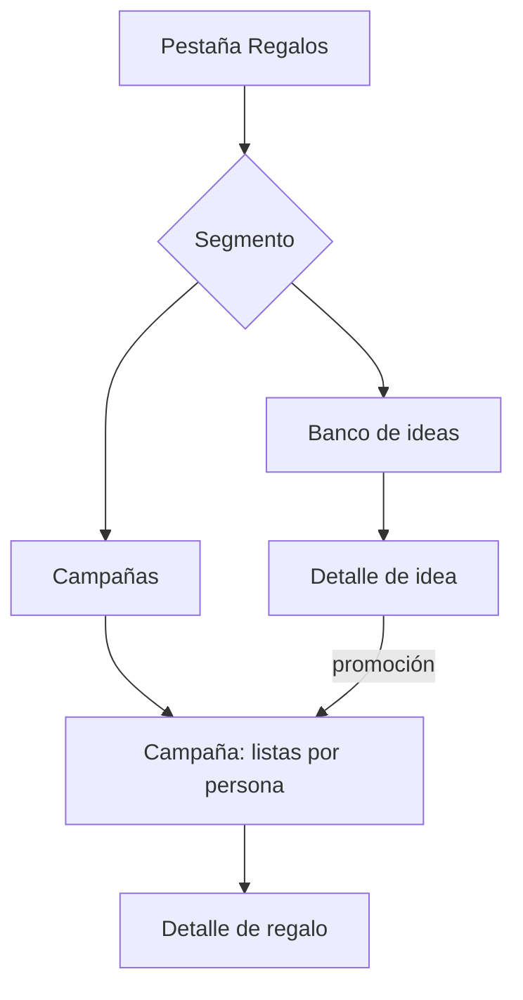
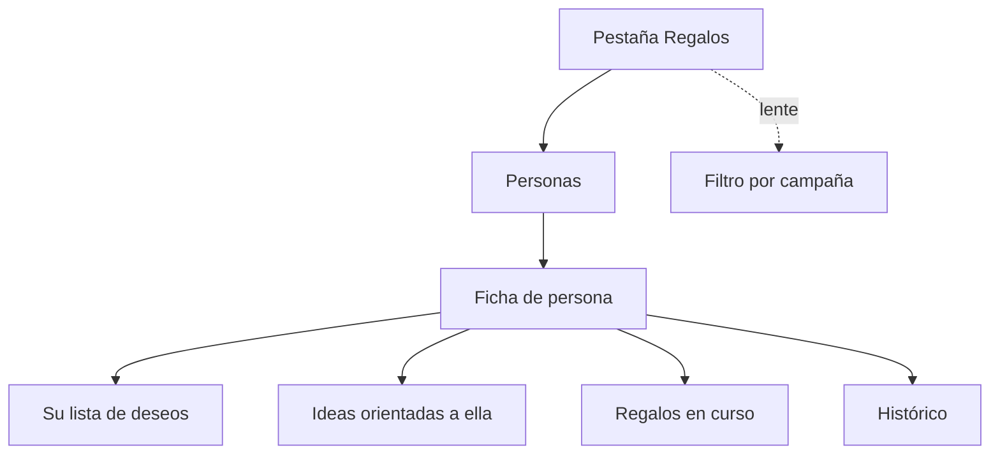
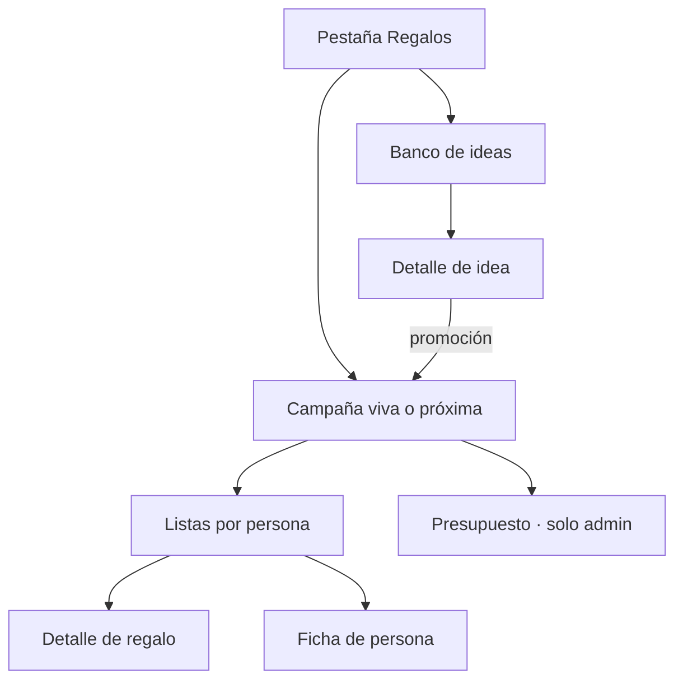
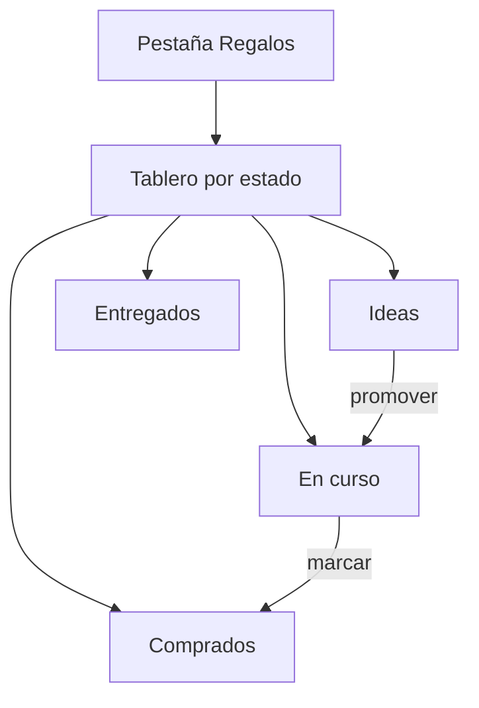

# Agenda Familiar — Experiencia de Usuario del módulo de Regalos

**Versión:** 0.1
**Fecha:** 24 de julio de 2026
**Documentos complementarios:** Especificación Funcional v0.8 · Modelo de Datos v0.3 · Propuesta de UX v0.5
**Alcance:** organización interna y flujos de la pestaña Regalos, que unifica el banco de Ideas y las Ocasiones. Da por decidida la arquitectura general de la propuesta de UX (la semana abre la aplicación; Regalos es una pestaña que se visita con intención). No aborda la pantalla de semana ni el Anecdotario.

---

## 1. Punto de partida

La propuesta de UX v0.5 dejó dos decisiones que este documento hereda y no reabre. La primera: **Ideas y Ocasiones son el mismo objeto en dos momentos de su vida**, y por eso viven bajo una sola pestaña, Regalos, en lugar de las dos secciones separadas del modelo de datos. Hay un banco permanente de ideas y hay campañas con fecha; una idea nace en el banco y se promueve a una campaña. La segunda: **la ficha de persona de la opción C es la mejor pantalla de detalle del producto** y se reutiliza aquí como destino, no como eje de navegación.

Lo que queda por decidir es cómo se organiza el interior de esa pestaña. El banco, las campañas, los deseos, el presupuesto y el histórico son cinco superficies que compiten por una sola sección, y el orden en que se presentan determina si la coordinación de Navidad es fluida o penosa, y si una idea se captura en diez segundos o no se captura.

Es también la sección donde la ocultación por destinatario tiene todo su peso. En la semana un error de visibilidad revela como mucho que hay un evento; aquí revela un regalo y su destinatario. Cada opción se juzga, entre otras cosas, por lo difícil que hace filtrar una sorpresa.

---

## 2. Criterios de evaluación

Se conservan los criterios generales de la propuesta de UX y se añaden los que solo aplican a esta sección.

**Reconocimiento antes que memoria.** Los selectores de persona muestran iniciativa, nombre y próxima ocasión; los de idea, título, precio orientativo y quién la propuso.

**Divulgación progresiva.** La captura pide un título; la clasificación se ofrece debajo y no se reclama. La descripción se exige al promover, no al capturar.

**La ocultación debe ser indetectable.** Sin huecos, sin numeraciones interrumpidas, sin contadores que no cuadren, sin tiempos de carga distintos. El recuento de cualquier lista, contador o resumen se calcula sobre lo visible para quien mira.

**Estacionalidad.** La sección concentra su actividad en noviembre y diciembre y en torno a cuatro o cinco cumpleaños. Diez meses al año el banco es lo único vivo. Una organización que dé el mismo peso permanente a las campañas malgasta la pantalla la mayor parte del tiempo.

**Dos perfiles en la misma pantalla.** Ana y Oscar coordinan, presupuestan y asignan responsables; las hijas desean, aportan ideas y consultan. La sección debe resultar densa para los primeros y ligera para las segundas sin bifurcarse en dos productos.

**El estado no se mantiene a mano.** La idea pasa a *en curso* y a *cerrada* por lo que ocurre en la campaña, no por una acción del usuario. La interfaz no debe ofrecer nunca un control para fijar esos estados; solo el descarte y la reactivación son manuales.

**Captura en diez segundos.** Una idea se anota en una tienda. El camino de captura no puede depender de estar en la pantalla correcta.

---

## 3. Decisiones comunes a todas las opciones

Estas resoluciones no dependen de cómo se organice la sección y se adoptan en cualquier caso.

**La captura no vive en Regalos.** El botón de crear pertenece a la pantalla. En Regalos crea una idea; en la ficha de una persona, una idea ya orientada a ella; en el detalle de un evento, un regalo entre los de sus participantes. La captura urgente (G1) no obliga a entrar en la sección: se resuelve con el botón global esté donde esté el usuario. Esto descarga a la organización de Regalos de tener que optimizar la captura, y la libera para optimizar la coordinación y la consulta, que son sus usos propios.

**El deseo se encamina solo.** Cuando alguien registra una idea cuyo único destinatario es él mismo, el sistema la reclasifica como deseo y la lleva a su lista, donde nunca se le oculta. El usuario no elige entre «idea» y «deseo»: escribe para quién es, y el destino se deriva.

**El panel «Por aquí no se mira».** Sobre la propia lista —dentro de una campaña, en la ficha propia, donde corresponda— aparece siempre ese panel, sin recuento ni fecha, exista o no contenido. Al ser constante no informa de nada.

**El estado del regalo es una fila de puntos, no una acción.** Pendiente, comprado, envuelto, entregado se presentan como un avance de cuatro pasos que se toca para adelantar. El coste real se pide como opcional en el mismo gesto, nunca como requisito para marcar.

**El presupuesto es una capa de administrador.** El panel de presupuesto y el importe previsto por persona solo existen para Ana y Oscar. Para un miembro, esa superficie no aparece: no hay un panel bloqueado, porque la existencia del presupuesto no es información que deba negarse pero tampoco que deba mostrarse a quien no la gestiona.

**Selección por reconocimiento en la promoción.** Promover una idea a una campaña es una única acción. El selector de campaña propone la más próxima por defecto; el de destinatario, las personas ya participantes.

---

## 4. Recorridos de contraste

Las opciones se evalúan contra cinco recorridos propios de esta sección.

**G1 — Captura de idea.** Ves en una tienda algo para tu madre. Diez segundos, sin pensar en fechas.
**G2 — Coordinación de Navidad.** Es noviembre. Ana y tú repartís doce destinatarios: veis qué falta, quién compra qué y cómo va el presupuesto.
**G3 — Deseo y consulta.** Una hija añade algo a su lista y quiere ver qué han pedido sus hermanas para no repetir.
**G4 — Promoción y compra.** Una idea del banco se convierte en el regalo de una campaña, alguien se asigna como responsable y, semanas después, lo marca como comprado.
**G5 — Memoria.** Antes del cumpleaños del abuelo, comprobar qué se le regaló los años anteriores.

---

## 5. Opción 1 — Banco y Campañas

Un control segmentado en la cabecera parte la sección en las dos entidades del modelo. *Banco* es la lista permanente de ideas con sus filtros; *Campañas*, la lista de ocasiones abiertas y cerradas.



```
┌────────────────────────────┐
│ Regalos                 ⟳  │
│ [ Banco ]  [ Campañas ]    │
├────────────────────────────┤
│ 🔎 filtro: persona·precio  │
│                            │
│  Zapatillas de trail       │
│   45–60 €  · lo propuso Ana│
│  Curso de cerámica         │
│   en curso · Navidad 2026  │
│  Libro de cocina tailandesa│
│   para: papá               │
└────────────────────────────┘
```

**G1 captura.** Indiferente: la captura es global. Al abrir el banco después, la idea recién creada está arriba.
**G2 Navidad.** Correcto. La campaña de Navidad es una entrada de la lista de Campañas y dentro tiene el reparto por persona. Exige un toque de más para llegar, todos los años, a lo único que importa en diciembre.
**G3 deseo.** Regular. La lista propia y las ajenas no tienen un lugar obvio: los deseos son ideas orientadas dentro del banco, mezcladas con las sugerencias. Ver «qué ha pedido mi hermana» obliga a filtrar el banco por persona.
**G4 promoción.** Bueno. Desde el detalle de la idea, promover; el estado *en curso* se refleja en el propio banco.
**G5 memoria.** Débil. El histórico de una persona está repartido entre las campañas cerradas; no hay una vista que lo reúna sin recorrerlas.

**Fortalezas.** Es la organización más barata de construir y la de menor coste de aprendizaje, porque la interfaz es el modelo de datos sin capa intermedia. Cada objeto está donde su nombre indica.

**Debilidades.** Refleja la estructura del sistema y no la tarea. La unificación de Ideas y Ocasiones que la arquitectura persigue queda a medias: siguen siendo dos pestañas dentro de una pestaña. Diez meses al año el segmento de Campañas está casi vacío y ocupa la mitad de la cabecera. Y las tres cosas que más se hacen —desear, coordinar Navidad, recordar qué se regaló— no tienen un lugar de primera línea.

**A quién conviene.** A una primera versión que priorice el coste y la previsibilidad sobre el ajuste a la tarea, con la intención de evolucionar después.

---

## 6. Opción 2 — La persona

El banco desaparece como pantalla de primer nivel. Regalos abre con la lista de personas, y todo lo relativo a los regalos de alguien vive en su ficha: sus deseos, las ideas orientadas a ella, sus regalos en curso y su histórico. La campaña es una lente que se aplica encima («ver solo lo de Navidad»).



```
┌────────────────────────────┐
│ Regalos                 ⟳  │
├────────────────────────────┤
│  (AG) Ana    (LG) Lucía    │
│  (MG) Marta  (JG) abuelo   │
│                            │
│  ─ abuelo ───────────────  │
│  Deseos        —           │
│  Ideas         3           │
│  En curso      1 · Navidad │
│  Histórico     ver años    │
└────────────────────────────┘
```

**G1 captura.** Bueno con el botón global; peor si obliga a entrar antes en la persona.
**G2 Navidad.** El punto débil. Coordinar doce destinatarios exige recorrer doce fichas, y la visión de conjunto —qué falta, cuánto se lleva gastado— no tiene un lugar natural. El presupuesto de una campaña es transversal a las personas y aquí no cabe.
**G3 deseo.** Excelente. La ficha propia es la lista de deseos; la de una hermana muestra la suya. Es la lectura más directa de las cinco opciones.
**G4 promoción.** Bueno. Desde la ficha se promueve la idea a la campaña próxima.
**G5 memoria.** Excelente. El histórico está donde uno lo busca: en la persona.

**Fortalezas.** Refleja cómo se piensa un regalo, que parte de alguien y no de una categoría. Concentra el valor acumulado de la ficha —tallas, preferencias, histórico, deseos— en un solo lugar. Y resuelve la ocultación con naturalidad: la ficha propia es, simplemente, la que muestra el panel reservado.

**Debilidades.** La coordinación de una campaña con muchos destinatarios es laboriosa y el presupuesto no encuentra sitio, que es precisamente lo que Ana y Oscar más necesitan en diciembre. Es una pantalla de consulta y archivo, no de coordinación.

**A quién conviene.** Como eje principal, a una familia cuyo interés dominante sea el archivo de personas. Como pantalla de detalle dentro de otra opción, es insustituible.

---

## 7. Opción 3 — La campaña viva

La sección compone alrededor de la ocasión pertinente en cada momento. En noviembre y diciembre, Navidad ocupa la cabecera con su reparto por persona y su barra de presupuesto. En marzo, cuando no hay campaña abierta relevante, la cabecera la ocupan el próximo cumpleaños con ocasión y, debajo, el banco de ideas. La sección cambia de forma tres veces al año sin que nadie la configure.



```
┌────────────────────────────┐
│ Regalos                 ⟳  │
├────────────────────────────┤
│ NAVIDAD 2026        30 dic  │
│  12 personas · 4 sin idea  │
│  Tú: 3 por comprar         │
│  Presupuesto  620/900 €    │  ← solo admin
│  [ abrir reparto ]         │
│                            │
│ BANCO                      │
│  Zapatillas de trail       │
│  Curso de cerámica         │
│  + ver todo el banco       │
└────────────────────────────┘
```

**G1 captura.** Indiferente por el botón global; la idea aparece de inmediato en el bloque del banco.
**G2 Navidad.** Óptimo. Es la única opción en la que lo que importa en diciembre es lo primero que se ve, con el reparto y el presupuesto a un toque.
**G3 deseo.** Correcto. El deseo se captura con el botón global; ver las listas ajenas requiere entrar en la ficha, que es un destino secundario aquí.
**G4 promoción.** Óptimo. La campaña viva está delante; promover una idea del bloque inferior a ella es inmediato.
**G5 memoria.** Correcto. El histórico se consulta desde la ficha de persona, alcanzable pero no en primer plano.

**Fortalezas.** Se ajusta al ritmo real de uso: da todo el peso a la campaña cuando la hay y lo retira cuando no. Es la única que aloja el presupuesto en un lugar propio sin sacar a los miembros de la pantalla. Y realiza de verdad la unificación buscada: no hay un segmento «Banco» y otro «Campañas», hay una pantalla que es sobre todo la campaña, con el banco debajo.

**Debilidades.** Una pantalla compuesta es más difícil de acertar y más cara de construir: hay que decidir qué bloque se muestra, con qué umbral y en qué orden, y esas reglas deben ser explícitas o la pantalla resultará impredecible. Existe el riesgo conocido de que un panel de resumen deje de leerse. Y depende de la ficha de persona (opción 2) para la consulta y el histórico, que quedan en segundo nivel.

**A quién conviene.** A una familia que coordine regalos con regularidad estacional y valore que la aplicación le ponga delante lo pertinente sin pedírselo. Es la opción de mayor techo y mayor riesgo de ejecución.

---

## 8. Opción 4 — El tablero

La sección se organiza por el avance del regalo, no por persona ni por campaña. Columnas o secciones sucesivas: ideas disponibles, en curso, comprados, entregados. La coordinación —quién lleva cada regalo y en qué punto está— es el eje.



```
┌────────────────────────────┐
│ Regalos · Navidad 2026  ⟳  │
├────────────────────────────┤
│ POR COMPRAR (5)            │
│  Curso cerámica → mamá·Ana │
│  Auriculares   → Lucía·tú  │
│ COMPRADO (3)               │
│  Libro cocina  → papá·Ana  │
│ ENTREGADO (1)              │
│  Bufanda       → abuela    │
└────────────────────────────┘
```

**G1 captura.** Indiferente por el botón global.
**G2 Navidad.** Muy bueno para el seguimiento de la compra: se ve de un vistazo qué falta por comprar y quién lo lleva. Peor para el reparto por persona, que es como se piensa el regalo y como se revisa el presupuesto individual.
**G3 deseo.** Débil. El deseo y la consulta de listas ajenas no encajan en un tablero de estado de compra.
**G4 promoción.** Óptimo. Es literalmente el flujo que el tablero representa.
**G5 memoria.** Débil. El histórico no es un estado del tablero, es una consulta por persona.

**Fortalezas.** Hace visible el trabajo de coordinación como ninguna otra: el estado de cada regalo, que en las demás opciones es un dato dentro del detalle, aquí es la estructura. Reduce la duplicidad de compra a un vistazo.

**Debilidades.** Es la organización más alejada de cómo la familia habla de los regalos, que es por persona y por ocasión, no por fase. Un tablero de estado es un instrumento de gestión que sirve a Ana y Oscar y resulta ajeno a las hijas, lo que rompe el criterio de los dos perfiles. Y no tiene lugar para el banco permanente, que es lo único vivo la mayor parte del año.

**A quién conviene.** Como vista secundaria dentro de una campaña —una lente «por estado» sobre el reparto—, es útil. Como organización principal de la sección, sirve a un solo perfil.

---

## 9. Comparación

| Criterio | 1. Banco+Campañas | 2. Persona | 3. Campaña viva | 4. Tablero |
|---|---|---|---|---|
| Coste de aprendizaje | Muy bajo | Medio | Bajo | Medio |
| G1 Captura | Indiferente | Bueno | Indiferente | Indiferente |
| G2 Navidad | Correcto | Débil | Óptimo | Muy bueno |
| G3 Deseo y consulta | Regular | Excelente | Correcto | Débil |
| G4 Promoción y compra | Bueno | Bueno | Óptimo | Óptimo |
| G5 Memoria | Débil | Excelente | Correcto | Débil |
| Ajuste a la estacionalidad | Débil | Medio | Fuerte | Medio |
| Encaje del presupuesto | Fuera de sitio | Fuera de sitio | Propio | Ajeno |
| Sirve a los dos perfiles | Sí | Sesgo consulta | Sí | Sesgo gestión |
| Coste de construcción | Bajo | Medio | Alto | Medio |
| Riesgo de ejecución | Bajo | Medio | Alto | Medio |

---

## 10. Recomendación

**Dirección elegida: la opción 3 como columna vertebral, con la ficha de persona de la opción 2 como pantalla de detalle y el tablero de la opción 4 reducido a una lente dentro de la campaña.**

Es la única coherente con la arquitectura ya decidida. Si la semana abre la aplicación porque es la unidad real de la vida familiar, Regalos se visita con intención y en un momento concreto del año; su pantalla debe reflejar ese momento. La campaña viva delante, el banco detrás, y la sección que cambia de forma con la estación resuelve a la vez la estacionalidad, la unificación de Ideas y Ocasiones, y el único hueco propio del presupuesto.

La ficha de persona no se pierde: es el destino al que se llega desde una lista de la campaña y desde el banco, y el único lugar donde el deseo propio, el histórico y los atributos acumulados se leen juntos. La opción 2 era insustituible como detalle y débil como eje; aquí ocupa exactamente el papel que le corresponde.

El tablero de la opción 4 se conserva como una de las dos presentaciones del reparto de una campaña —agrupación por persona, natural en Navidad, o lista única filtrable por estado, práctica para revisar la compra—, tal como prevé el apartado 6.1 de la especificación funcional. No es una organización de la sección, sino una lente sobre una campaña.

Se descarta la opción 1 como destino, no como punto de partida. Es una primera versión legítima y la más barata, y puede evolucionar hacia la 3 sin rehacer la navegación: la pantalla compuesta se antepone a los dos segmentos cuando el producto lo justifique. Si el riesgo de ejecución de la composición estacional resulta inasumible en la primera entrega, arrancar por la opción 1 y añadir la cabecera de campaña después es un camino defendible.

---

## 11. Detalle de la dirección elegida

### 11.1 La pantalla de Regalos

Tres bloques, cuya presencia y orden dependen de la estación.

**Cabecera de campaña.** Cuando hay una ocasión abierta cuya fecha está dentro de un horizonte próximo —Navidad desde noviembre, un cumpleaños desde tres o cuatro semanas antes—, ocupa la parte superior. Muestra el nombre, la fecha, el número de personas y cuántas están «sin idea», y una línea propia del observador: «tú: 3 por comprar». Para un administrador añade la barra de presupuesto. Un toque abre el reparto.

Cuando hay más de una campaña próxima —el caso de un cumpleaños en diciembre solapado con Navidad—, se muestran ambas cabeceras por orden de fecha. El umbral y el solapamiento son las reglas que el apartado 13 deja abiertas.

**Banco de ideas.** Siempre presente. En temporada, como una tira breve de las últimas ideas con un enlace a la lista completa; fuera de temporada, como el bloque principal de la pantalla, con sus filtros por persona, etiqueta, categoría y precio. El banco no desaparece nunca, porque la captura continua es su razón de ser y una idea anotada en marzo debe tener dónde caer.

**Sin campaña próxima.** La cabecera la ocupa el próximo cumpleaños con ocasión asociada, en forma de invitación a abrir su campaña, y el banco pasa a primer plano. La pantalla nunca queda vacía ni muestra un bloque de campaña hueco.

### 11.2 El reparto de una campaña

Es la pantalla de coordinación, y su composición depende del observador conforme a la función de visibilidad del modelo de datos. Ofrece las dos presentaciones del apartado 6.1 funcional, conmutables:

- **Por persona.** Una sección por destinatario con cuenta o sin ella, con sus regalos. La sección del propio observador se sustituye por el panel «Por aquí no se mira». La de una persona sin cuenta —los abuelos— es visible para todos los miembros.
- **Lista única.** Todos los regalos visibles en una lista con filtros por estado, responsable y categoría. Es la lente que recoge lo mejor de la opción 4.

El presupuesto por persona y la barra agregada solo aparecen para administradores. El recuento de «sin idea», el total gastado y cualquier sumatorio se calculan sobre los regalos visibles para quien mira, nunca sobre el conjunto real.

### 11.3 El regalo dentro del reparto

Cada regalo muestra destinatario, responsable de compra y avance de estado en una fila de una línea. El avance —pendiente, comprado, envuelto, entregado— se adelanta con un toque, y ofrece registrar el coste real como paso opcional en el mismo gesto. La marca de compartido incorpora co-destinatarios, y la ocultación alcanza a todos ellos. Asignarse como responsable es la acción que evita la doble compra: en cuanto Ana lo toma, Oscar lo ve asignado.

### 11.4 La ficha de persona como detalle

Se llega a ella desde una sección del reparto y desde una idea del banco. Reúne, para el observador, la lista de deseos de esa persona, las ideas orientadas a ella, sus regalos en curso, su histórico derivado de ocasiones cerradas y sus atributos. Sobre la ficha propia, deseos e ideas orientadas a uno mismo se muestran con normalidad —el deseo nunca se oculta a su autor—, mientras que las ideas y regalos que otros han orientado hacia el observador no aparecen: en su lugar, el panel reservado.

### 11.5 La captura y la promoción

La captura no vive en esta sección: la resuelve el botón global. Al abrir Regalos, la idea recién capturada encabeza el banco. La promoción a campaña es una acción sobre la idea que propone la campaña próxima y el destinatario entre los participantes, y exige entonces —no antes— la descripción. Promovida la idea, su estado pasa a *en curso* de forma derivada y así se refleja en el banco, señalada con su campaña; nadie fija ese estado a mano.

---

## 12. Sobre la indetectabilidad en esta sección

La sección es donde más vías de filtración se abren, y conviene enumerar las que la organización elegida debe cerrar. Ninguna es nueva respecto de la especificación funcional; se recogen aquí porque es en estas pantallas donde se materializan.

**Los recuentos de la cabecera.** «4 sin idea», «tú: 3 por comprar», el total del presupuesto: todos se calculan sobre lo visible para el observador. Un destinatario nunca debe poder inferir de un recuento que existe un regalo para él.

**La tira del banco.** Las ideas orientadas al observador no aparecen en su banco, y su ausencia no deja hueco ni altera ningún contador. Una idea etiquetada —no orientada a una persona— sí es visible para quien encaja en la etiqueta: la interfaz lo advierte al etiquetar, porque la etiqueta clasifica y no protege.

**El histórico.** Se deriva de ocasiones cerradas y también atraviesa la función de visibilidad. El histórico que una hija ve de sí misma contiene lo que ya se le entregó, que dejó de ser sorpresa; no contiene regalos de ocasiones aún abiertas.

**La conmutación de presentaciones.** Pasar de «por persona» a «lista única» no puede revelar en una lo que la otra oculta. Ambas se componen sobre el mismo conjunto visible.

---

## 13. Cuestiones abiertas

1. Definir el umbral temporal que hace aparecer la cabecera de una campaña, y la regla de solapamiento cuando hay dos próximas.
2. Decidir la presentación por defecto del reparto —por persona o lista única— y si depende del rol: el reparto por persona favorece la consulta y la lista única el seguimiento de compra.
3. Determinar si el banco fuera de temporada muestra por defecto todas las ideas o solo las activas, dado que las *en curso* permanecen visibles señaladas con su campaña.
4. Confirmar si el presupuesto merece una vista propia dentro de la campaña o se resuelve con la barra de la cabecera más el importe por persona en el reparto.
5. Resolver, cuando se cierre su especificación, si la ficha de persona incorpora también las anécdotas de esa persona, lo que la acercaría a la ficha completa de la opción C original.
