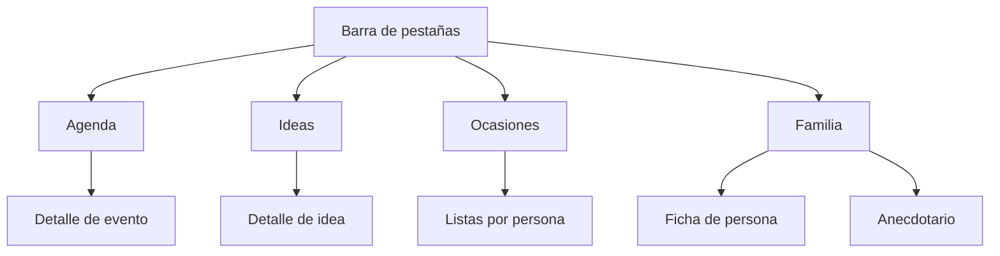
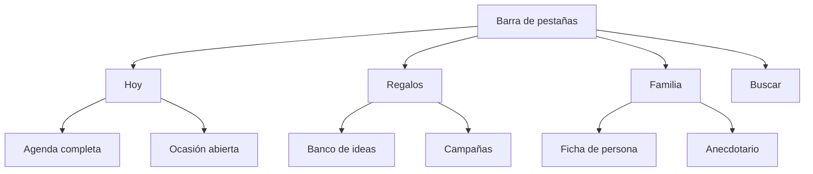
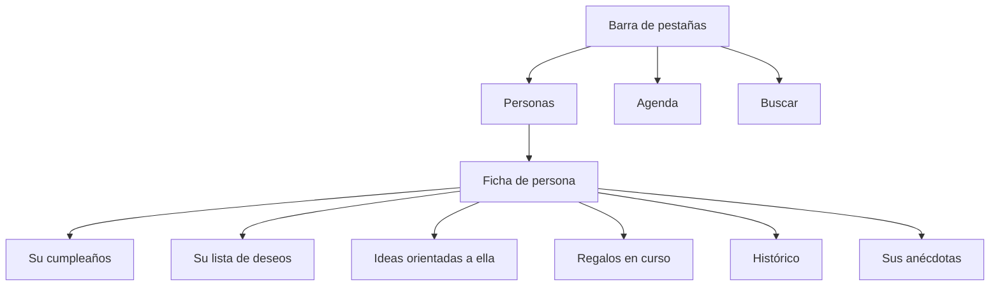
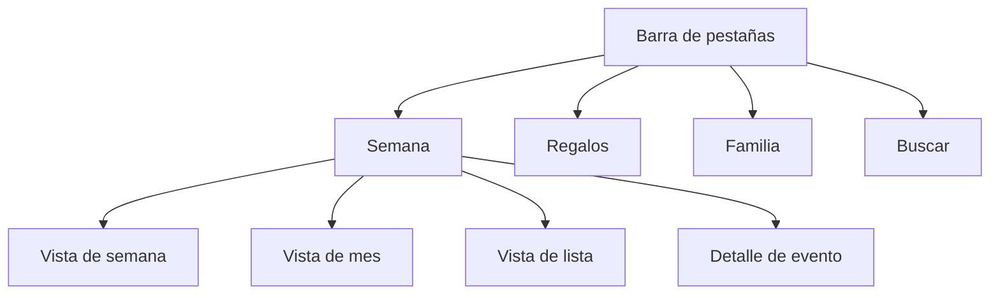
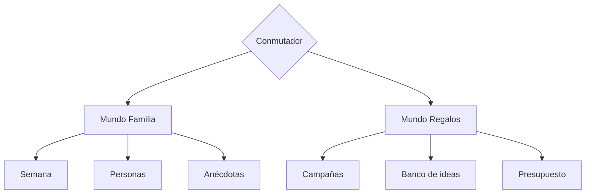

# Agenda Familiar — Propuesta de Experiencia de Usuario

**Versión:** 0.5
**Fecha:** 24 de julio de 2026
**Documentos complementarios:** Especificación Funcional · Modelo de Datos y Flujos

---

## 1. Criterios de evaluación

Las cinco opciones se han construido y contrastado con los mismos criterios, tomados de las guías de referencia del sector y recogidos en el apartado 9.

**Reconocimiento antes que memoria.** El usuario no debe recordar nada para operar. Al asignar un destinatario se muestran las personas con su iniciativa y su próxima ocasión, no un campo de texto en el que escribir un nombre.

**Divulgación progresiva.** Se presenta lo esencial y se difiere lo secundario. La captura de una idea pide un título; el resto de campos aparece solo si se piden.

**Coherencia con la plataforma.** Barra de pestañas para las secciones de primer nivel y nunca para acciones, entre tres y cinco en iPhone, navegación jerárquica para el detalle y presentación modal para las tareas puntuales.

**Prevención del error antes que su mensaje.** Un error bien redactado es peor que un error imposible. En este producto, el error grave es revelar una sorpresa.

**Interfaz optimista.** La escritura es local e inmediata. No hay indicadores de espera en el camino principal, porque una aplicación que hace esperar sin red se percibe como averiada.

**Accesibilidad.** Objetivos táctiles de 44 por 44 puntos, tipografía dinámica y contraste mínimo de 4,5 a 1.

---

## 2. Restricciones propias de este producto

Cuatro circunstancias condicionan el diseño más que cualquier preferencia estética.

**La ocultación debe ser indetectable.** No basta con no mostrar el contenido oculto. No debe haber huecos, numeraciones interrumpidas, contadores que no cuadren ni tiempos de carga distintos. Un adolescente atento deduce mucho de una discontinuidad.

**El uso es marcadamente estacional.** La agenda se consulta cada semana; las ocasiones concentran su actividad en noviembre y diciembre y en torno a cuatro o cinco cumpleaños. Una arquitectura que dé el mismo peso permanente a ambas cosas dedica media pantalla a algo inactivo diez meses al año.

**Conviven dos perfiles muy distintos.** Ana y Oscar coordinan, presupuestan y ocultan. Las hijas consultan, desean y aportan anécdotas. La misma aplicación debe resultar densa para los primeros y ligera para las segundas, sin construir dos productos.

**La captura compite con el mundo real.** Una idea se anota en una tienda, en una conversación o al bajar del coche. Si registrarla cuesta más de diez segundos, no se registra, y sin captura el resto del sistema carece de contenido.

---

## 3. Decisiones comunes a todas las opciones

Estas resoluciones no dependen de la arquitectura elegida y deberían adoptarse en cualquier caso.

**Captura en un gesto.** Un mismo punto de entrada, siempre accesible, que abre un campo de título y un botón de guardar. La clasificación —persona, categoría, precio— se ofrece debajo pero no se reclama. La idea nace incompleta y se enriquece después.

**El botón de crear pertenece a la pantalla, no a la aplicación.** Un único botón flotante cuya acción depende de dónde esté el usuario: en la semana crea un evento, en Regalos una idea, en la ficha de una persona una idea ya orientada a ella, y en el detalle de un evento asocia un regalo entre los de sus participantes. Un botón genérico obligaría a elegir el tipo antes de escribir, que es exactamente la fricción que la captura rápida trata de evitar. En las pantallas sin acción de creación —búsqueda y presupuesto— el botón no aparece.

**Escritura local e indicador discreto.** Toda acción se refleja de inmediato. Un indicador pequeño y permanente informa del estado de sincronización, con una marca de última actualización correcta. Nunca un bloqueo, nunca un modal.

**El panel "Por aquí no se mira".** Sobre el contenido propio, un panel siempre presente con esa leyenda, sin recuento ni fecha. Al ser constante, no informa de nada: ni su aparición ni su desaparición pueden interpretarse.

**Selección por reconocimiento.** Los selectores de persona muestran iniciativa, nombre y próxima ocasión relevante. Los de idea muestran título, precio orientativo y quién la propuso.

**Aprendizaje contextual.** Sin recorrido guiado inicial. Las indicaciones aparecen en el momento en que se necesitan: la advertencia de que las etiquetas no ocultan surge al escribir la primera etiqueta, no en una pantalla de bienvenida.

**Sin imágenes en la primera versión.** Los avatares se generan a partir de las iniciales con un color estable por persona, lo que sostiene el reconocimiento sin infraestructura de archivos.

---

## 4. Recorridos de contraste

Las cinco opciones se evalúan contra los mismos tres recorridos.

**R1 — Captura urgente.** Estás en una tienda y ves algo para tu madre. Diez segundos.
**R2 — Coordinación de Navidad.** Es noviembre. Ana y tú repartís doce destinatarios, veis qué falta y quién compra qué.
**R3 — Consulta ligera.** Una hija abre la aplicación el jueves para ver el plan del fin de semana y añadir un deseo.

---

## 5. Opción A — Cuatro pestañas

Cada módulo del modelo se corresponde con una pestaña.



**Pantalla de inicio:** la agenda en vista de lista cronológica.

```
┌────────────────────────────┐
│ Agenda                  ⟳  │
├────────────────────────────┤
│ ESTE FIN DE SEMANA         │
│  sáb  Torneo de hípica     │
│  dom  Comida con los abuelos│
│                            │
│ PRÓXIMAMENTE               │
│  12 nov  Cumpleaños abuela │
│  25 dic  Navidad           │
└────────────────────────────┘
│ Agenda  Ideas  Ocasiones  Familia │
└────────────────────────────┘
```

**R1, captura.** Tres toques: pestaña Ideas, botón de añadir, título. Correcto, aunque obliga a cambiar de sección.
**R2, Navidad.** Excelente. La pestaña de Ocasiones es un espacio dedicado con toda la coordinación reunida.
**R3, consulta ligera.** Correcto. La agenda abre por defecto y el deseo se añade desde Familia, lo que resulta poco evidente.

**Fortalezas.** Es la arquitectura más predecible y la de menor coste de aprendizaje. Cada cosa está donde su nombre indica. Es también la más barata de construir, porque la interfaz refleja el modelo de datos sin capas intermedias.

**Debilidades.** Refleja la estructura del sistema y no la tarea del usuario. La relación entre Ideas y Ocasiones —que son el mismo objeto en dos momentos de su vida— queda como algo que el usuario debe aprender. La pestaña de Ocasiones permanece prácticamente vacía de febrero a octubre, ocupando un cuarto de la navegación permanente. Y la lista de deseos, que es lo que más usarán las hijas, queda enterrada dentro de Familia.

**A quién conviene.** A una familia que quiera algo inmediatamente comprensible y no le importe que la aplicación sea un archivador correcto antes que un asistente.

---

## 6. Opción B — El momento

La pantalla principal compone lo que importa ahora. Ideas y Ocasiones se unifican en una sola sección, porque son el mismo objeto en dos estados.



**Pantalla de inicio:** una composición que cambia con la estación.

```
┌────────────────────────────┐
│ Hoy                     ⟳  │
├────────────────────────────┤
│ ESTE FIN DE SEMANA         │
│  sáb  Torneo de hípica     │
│  dom  Comida con los abuelos│
│                            │
│ NAVIDAD 2026               │
│  12 personas · 4 sin idea  │
│  Tú tienes 3 por comprar   │
│                            │
│ ÚLTIMAS IDEAS              │
│  Zapatillas de trail       │
│  Curso de cerámica         │
└────────────────────────────┘
│  Hoy   Regalos   Familia   🔍 │
└────────────────────────────┘
```

En marzo, el bloque de Navidad no aparece y su espacio lo ocupan el próximo cumpleaños y las ideas recientes. La aplicación cambia de forma tres veces al año sin que nadie la configure.

**R1, captura.** Óptimo si el botón de captura reside en la capa global de la barra inferior, accesible desde cualquier pestaña. Dos toques.
**R2, Navidad.** Muy bueno. El bloque de la pantalla de inicio lleva directamente al reparto, y la sección de Regalos ofrece el detalle.
**R3, consulta ligera.** Óptimo. El fin de semana es lo primero que se ve al abrir.

**Fortalezas.** Se ajusta al ritmo real de uso. Reduce la navegación a tres destinos y una búsqueda, dentro de la horquilla recomendada. Unificar Ideas y Ocasiones bajo Regalos elimina la distinción conceptual que en la opción A el usuario debía aprender: hay un banco y hay campañas, y una idea pasa de uno a otra.

**Debilidades.** Una pantalla compuesta es más difícil de acertar y más costosa de construir: hay que decidir qué se muestra, en qué orden y con qué umbrales. Existe el riesgo conocido de que un panel de resumen deje de leerse. Y la composición estacional debe apoyarse en reglas explícitas, o la pantalla resultará impredecible.

**A quién conviene.** A una familia que use la aplicación con regularidad y valore que le presente lo pertinente sin pedírselo. Es la opción con mayor techo y también con mayor riesgo de ejecución.

---

### 6.1 La pantalla de ocasiones, como se construyó

Lo que sigue no es una opción sino la decisión tomada. La pestaña de Regalos se quedó con las secciones de esta opción —Ideas y Ocasiones, y más tarde Regalos entre las dos (§6.2) y Deseos delante de todas (§6.3)—, y esto es lo que hay dentro de la de Ocasiones.

**Hay dos tipos de ocasión, y por eso hay dos apartados.** Una **fecha señalada** —Navidad, Reyes, un aniversario— es una ronda: mucha gente, muchos regalos y una coordinación que dura semanas. Un **cumpleaños** es lo contrario: una persona, una fecha que vuelve sola cada año y, casi siempre, un mensaje que mandar. Mezclados en una sola lista había que leerla entera para encontrar cualquiera de las dos cosas.

El nombre del primer apartado es el que se usa en casa para esas fechas. Mientras se diseñaba se llamó *campañas*, que describe bien el trabajo pero que nadie usa: a la Navidad no se la llama campaña.

```
┌──────────────────────────────┐
│ Regalos            ⟳    ⚙   │
│ ┌ Deseos ┬ Ideas ┬ Regalos ┬ Ocasiones ┐│
├──────────────────────────────┤
│ Fechas señaladas  1 en marcha ⌃│
│ ┌──────────────────────────┐ │
│ │ Navidad 2026      25 Dic │ │
│ │ 3 personas · sin regalos │ │
│ └──────────────────────────┘ │
│ [ Nueva fecha señalada ]     │
│                              │
│ Cumpleaños  el próximo, la abuela en 4 días ⌄│
└──────────────────────────────┘
```

**Los dos se pliegan, y los dos arrancan abiertos.** Lo que se viene a mirar está en los dos, y plegar sirve para quitar de en medio lo que hoy estorbe, no para tener que abrir algo cada vez que se entra. El rótulo de los cumpleaños dice de todos modos quién es el próximo y cuánto falta, que es lo que hace que plegarlos no cueste nada. Lo que se pliegue se queda plegado mientras dure la sesión, porque la pantalla se rehace en cada sincronización y si no, plegar algo duraría unos segundos.

**Cada cumpleaños dice tres cosas y ninguna dos veces.** El nombre va entero, con apellidos, que es lo que distingue a dos Marías en una lista que las lleva a todas. A la derecha, cuánto falta: en días si es pronto, y por la fecha —«el 12 de Mayo»— cuando queda medio año, que es lo único que significa algo a esa distancia. **Con los de casa la cuenta atrás no se apaga nunca**: sus cumpleaños se llevan así todo el año, y «en 213 días» dice algo que su fecha no dice. Debajo, los años que cumple y qué hay pensado; y la fecha entera **solo cuando arriba van los días**, porque si la pastilla ya dice el día, escribirlo otra vez dos renglones más abajo es leer dos veces lo mismo.

**Al abrir una fecha señalada, cada persona es una sección que dice cómo va lo suyo.** El nombre encabeza con cuerpo de título —era un rótulo diminuto en versalitas y pesaba menos que el título de sus regalos, siendo lo que organiza la pantalla— y el «+» que le añade un regalo va al final de esa misma línea: antes era un enlace por sección, «Añadir un regalo para X», y con seis personas eran seis renglones diciendo lo mismo. Debajo, en voz baja, las tres cuentas que se vienen a mirar en noviembre: cuántos regalos hay, cuántos quedan **por comprar** —que no es una palabra nueva, es el nombre del estado que lleva la pastilla de cada uno— y cuánto suman. Quien no tiene nada asignado sale igual, y su renglón lo dice: es precisamente a quien hay que mirar.

**«Cuánto se va a gastar» junta lo pagado y lo previsto, y avisa de que lo hace.** Un regalo solo tiene importe cuando alguien lo escribe *después* de comprarlo, así que para lo que aún no está comprado se usa el precio que se le apuntó a la idea. La cifra sale con `≈` en cuanto lleva una estimación dentro, y lo que no tiene ni importe ni precio no suma cero: se cuenta aparte —«1 sin precio»— porque sin eso la suma se leería como si estuviera completa. Es la misma regla que se escribió en su día para no enseñar una desviación favorable inexistente, y de paso le da un uso al precio de la idea, que se pedía en el formulario y no se leía en ningún sitio.

**No hay un total de la ocasión, y no puede haberlo.** Las cuentas se calculan con lo que quien mira tiene delante, y los regalos para uno mismo no se le transmiten nunca. Un total sería «lo que cuesta la Navidad de los demás, vista por mí»: valdría una cosa distinta en cada teléfono, y comparar dos pantallas delataría cuánto se ha gastado en quien mira. Por eso las cifras van por persona y ninguna se llama total.

**El orden de las personas es el de los círculos, y dentro de cada uno la edad.** Primero los de casa, después la familia de fuera y al final los amigos; dentro de cada círculo, los mayores delante. La edad y no el próximo cumpleaños: el orden de una Navidad no puede cambiar de un día para otro porque alguien haya cumplido años. Quien no tiene fecha de nacimiento cierra su círculo por orden alfabético, porque no se le puede colocar por una edad que no está.

**Uno mismo va siempre, y siempre el último**, participe o no de la ocasión. Participe o no, porque su ausencia sería información: no verse a uno mismo en la Navidad de la casa diría que nadie le ha puesto nada. Su sección es el sello de siempre, sin cuentas y sin «+»: el recuento de lo propio es justo lo que no se puede enseñar, y a uno mismo no se le añade un regalo desde aquí.

**Duplicar la ocasión del año pasado se retiró.** Traía el nombre con el año siguiente y las mismas personas marcadas, pero crear la de este año son cuatro toques, las personas rara vez son las mismas y lo único que ahorraba era teclear el nombre, que es el trabajo que menos cuesta. Al pie queda «Darla por cerrada», que sí se hace una vez por ocasión y no tiene otro sitio desde el que hacerse.

**Los cumpleaños no son filas de nada.** Salen de la fecha de nacimiento de cada ficha, igual que en la agenda, y se ordenan por el aniversario que viene: primero el que está más cerca. No se editan ni se borran desde aquí —se corrigen en la ficha, que es el dato de origen— y por eso su pastilla no lleva verbos detrás. A quien no tiene fecha no se le inventa una: no sale en la lista, pero al pie se dice cuántos son, porque un cumpleaños del que la agenda no va a avisar nunca es algo que conviene saber.

**Qué ocasión es el cumpleaños de quién no se guarda: se deduce.** Una ocasión que cae el mismo día del año que nació uno de sus participantes es su cumpleaños, y por eso no aparece entre las fechas señaladas. Así se reconocen también las que se crearon antes de que esta pantalla existiera, y el dato no puede quedarse desactualizado. La ocasión de un cumpleaños no se crea hasta que hace falta —al asociarle el primer regalo—, y lo que la ata a él son la fecha y el participante: un cumpleaños no tiene fila en `evento` a la que apuntar con `evento_id`.

**Al abrir un cumpleaños pasan tres cosas**, en el orden en que hacen falta:

1. **Cuándo es y cuántos cumple.** Los años que cumple, no los cumplidos: el día mismo son los mismos, y a partir del día siguiente se habla ya del próximo.
2. **La felicitación.** Es lo que de verdad se hace un cumpleaños. La escribe un modelo con lo que la agenda sabe de esa persona, se pasan cinco como se pasan las propuestas de regalo, se piden otras cinco si ninguna vale y se **copia al portapapeles** en lugar de guardarse: no es un dato de la agenda, es un mensaje que se manda una vez por WhatsApp. Es el único texto de la aplicación con emojis, porque en un WhatsApp de cumpleaños son la mitad del tono.
3. **Qué se le regala**, con los regalos de su ocasión si alguien ya la abrió y, si no hay ninguno, cuántas ideas hay apuntadas para esa persona.

Debajo, un enlace a su ficha, que es donde está todo lo demás.

**Lo que se le cuenta al modelo para felicitar es menos que para un regalo, y no por ahorrar.** La felicitación se le manda a quien cumple, así que solo puede llevar lo que esa persona ya sabe de sí misma: su nombre, qué es en la familia, los años que cumple y lo que hay apuntado sobre ella. Las ideas, los regalos y lo que recibió otros años se quedan fuera; un modelo al que se le da un regalo pendiente acaba mencionándolo.

**Sobre el cumpleaños propio no hay nada que mirar.** Ni felicitación —felicitarse uno mismo no es nada— ni regalos: en su sitio va el sello de siempre. El recuento tampoco aparece en la pastilla, ni siquiera en cero, porque si solo saliera cuando existe, su ausencia contaría lo mismo que su presencia.

**Los verbos de una fecha señalada están detrás de su pastilla.** Se desliza a la izquierda y aparecen editar y borrar. Es el atajo, no el camino: tocarla la abre, y dentro está el mismo *editar* arriba junto al título, como en un evento y como en una idea. El desplazamiento vertical manda —si el dedo baja, es la página la que se mueve—, solo una fila puede estar abierta a la vez y, con ella abierta, el primer toque sobre la pastilla la recoge en lugar de abrir el detalle. Con el teclado no hay gesto que hacer: los dos botones existen en el árbol y la fila se abre sola al enfocarlos.

**Borrar pregunta, y pregunta diciendo qué se lleva por delante.** Los regalos cuelgan de la ocasión, y una Navidad con ocho apuntados no puede desaparecer de un dedo distraído. Se retiran con ella: dejarlos vivos apuntando a una ocasión que ya no está los volvería invisibles pero no inexistentes, y sus ideas se quedarían «en curso» para siempre, señaladas con una ocasión que nadie puede abrir. Las ideas se quedan en el banco, disponibles para otra ocasión.

**Cuándo dejará de servir.** El día que las fechas señaladas cerradas se acumulen —una Navidad al año— el apartado pedirá archivarlas o agruparlas por año. Nada de lo de aquí lo impide.

### 6.2 La pantalla de regalos, como se construyó

Entre Ideas y Ocasiones hay una tercera sección, y existe porque el ciclo se contaba a trozos. Una **idea** se apunta suelta; en un cumpleaños o en una fecha señalada se convierte en un **regalo** para alguien; el regalo espera mientras se compra; y termina cuando se entrega o cuando su ocasión se da por cerrada. De ese ciclo, la aplicación enseñaba el principio —el banco de ideas— y el contenedor —la ocasión—, pero no la parte de en medio, que es donde está el trabajo: qué falta por comprar y quién lo lleva. Para responder a eso había que abrir las ocasiones una por una y sumar de cabeza.

Por dentro siguen siendo dos entidades y no tres. Se estudió fundirlas —una idea con estados sería justo lo que se cuenta— y no conviene: una idea sirve para varias personas y varios años, un regalo es de una persona y de una fecha; el regalo tiene responsable, coste y ocasión, que en una idea están vacíos siempre; y sobre todo se ocultan de manera distinta, que es la pieza central del modelo. Lo que se funde es el relato, no las filas.

```
┌──────────────────────────────┐
│ Regalos            ⟳    ⚙   │
│ ┌ Deseos ┬ Ideas ┬ Regalos ┬ Ocasiones ┐│
├──────────────────────────────┤
│ QUIÉN SE ENCARGA             │
│ (Todos) ( Yo ) ( Nadie )     │
│ POR COMPRAR · 2              │
│ ┌──────────────────────────┐ │
│ │ Botas de montar te encargas tú│
│ │ para Marta · Cumpleaños de │
│ │ Marta 2026 · en 6 días   │ │
│ └──────────────────────────┘ │
│ ┌──────────────────────────┐ │
│ │ Hamaca de playa sin encargado│
│ │ para la abuela · … · en 4 días│
│ └──────────────────────────┘ │
│ LISTOS · 1                   │
│ ┌──────────────────────────┐ │
│ │ Curso de cerámica se encarga Ana│
│ │ para Rosa · Navidad 2026 · 38 €│
│ └──────────────────────────┘ │
│ Ya pasaron              1  ⌄ │
└──────────────────────────────┘
```

**Se ordena por estado y no por ocasión.** La pregunta que se trae aquí es «¿qué me falta por comprar?», y esa se contesta de una vez para todas las fechas; por ocasión ya está la pantalla de al lado. Son dos grupos, *Por comprar* y *Listos*, y cada uno dice cuántos lleva en el rótulo.

**La pastilla de la derecha dice quién se encarga**, que es lo que hay que repartir. Su esquina es corta —seis puntos— y no la cápsula que fue: en esta aplicación lo redondo del todo son los mandos —las pastillas de filtro, el botón de «Hoy», el flotante— y lo que se lee y no se toca lleva esquinas cortas, así que una etiqueta que solo informa vestida de botón invitaba a tocarla para no hacer nada. El seis es el de la casilla del selector de regalos, para no estrenar un valor más, y el cambio alcanza a las otras tres etiquetas de la aplicación: la fecha de una fecha señalada, el «en 4 días» de un cumpleaños y el estado de un regalo dentro de su ocasión. Las ocho formas que se estudiaron están en `specs/prototipo-etiqueta-del-regalo.html`. *Sin encargado* va marcado en color de aviso: no es un error, pero es lo único de la lista que pide que alguien haga algo. Con dos excepciones, que son los dos casos en los que el estado dice algo que el rótulo del grupo no dice ya: lo entregado, que dentro de *Listos* es lo único que se distingue del resto, y lo que se quedó sin comprar cuando la fecha ya pasó.

**Los tres filtros de arriba son los tres cortes que se hacen de verdad**: todos, de los que me encargo yo, y los que no lleva nadie. En un hogar de cuatro, la mitad de los regalos son de otros y en la lista solo estorban; y *Nadie* convierte la pantalla en la lista de lo que hay que repartir antes de que llegue la fecha.

Van bajo un rótulo —«Quién se encarga»— igual que las personas en Ideas van bajo «Para quién», y por eso las pastillas pueden ser de una palabra: el rótulo hace el trabajo de explicar y *Todos · Yo · Nadie* se lee como una escala. Decían «Los que llevo yo» y «Sin nadie», que hablaban de llevar —que suena a llevarlo en la mano el día de la fiesta— y no decían sin qué; lo que hay que nombrar es otra cosa: que alguien se ha hecho cargo de ese regalo, o que todavía no. La misma palabra va en la pastilla de cada línea, en el campo del detalle —«Quién se encarga», con «Nadie todavía» como opción vacía— y en el resumen de una ocasión. Las cuatro maneras que se estudiaron, con las anchuras medidas, están en `specs/prototipo-quien-se-encarga.html`.

**Pasada la fecha, nada desaparece solo.** Los regalos de una ocasión cuya fecha ya se fue bajan a un apartado plegado al final —*Ya pasaron*—, con lo que quedó sin comprar señalado. Archivar es esconder, y esconder solo lo que se ha terminado a medias sería esconder justamente lo que hay que mirar: una Navidad que se celebra el 26, o un cumpleaños que se junta el sábado siguiente, siguen haciendo falta el día después. Lo que los archiva de verdad es **dar la ocasión por cerrada**, que es un verbo que se ejerce a mano desde la ocasión y que manda sus regalos al histórico de quien los recibió.

**Cerrar se pregunta**, porque no tiene vuelta: da por cerradas también las ideas que salieron de allí, exactamente igual que ocurre ya cuando el último regalo se marca como entregado. Una idea cerrada es terminal por diseño; para volver a usarla se duplica.

**Desde un regalo se sale por dos puertas: su ocasión y su destinatario.** Un regalo no se entiende solo —se entiende por la fecha a la que va y por la persona que lo va a recibir—, y desde esta lista no había otra manera de llegar a ninguna de las dos. La ocasión va en el icono de información de la cabecera, y cuando es un cumpleaños lleva a la hoja del cumpleaños y no a la genérica: es allí donde de verdad se prepara, con los años, la felicitación y el resto de los regalos. Al destinatario se llega por su nombre, subrayado dentro de la frase que dice para quién es.

**Al abrir un regalo, lo que se toca está a la vista y no dentro de un desplegable.** Los dos campos que se usan de verdad son cómo va y quién se encarga, y los dos eran listas desplegables: abrir, buscar y elegir, tres toques para decir «ya está comprado». Los estados son tres, cortos y excluyentes, así que van en tres pastillas; y quien se encarga son los cuatro de casa, con el mismo campo de gente que el resto de la aplicación —los de casa a la vista y un «+» que busca al resto—. Marcar pasa a ser un toque. A quien recibe el regalo no se le ofrece: nadie se compra su propia sorpresa.

**Y se guarda al final, con su botón, no campo a campo.** Cada control escribía en cuanto se tocaba, que en una pantalla de un solo campo se defiende pero aquí no: un estado marcado sin querer ya estaba guardado, y no había manera de salir sin dejarlo hecho. Con *Guardar* y *Cancelar* —los mismos de un evento o de una idea— la hoja se lee como lo que es, un formulario. Quitar el regalo de su ocasión sube a la cabecera, junto al título, que es donde esta aplicación pone el borrado de todo lo que se edita.

**Cuándo dejará de servir.** El día que un diciembre acumule treinta regalos, los dos grupos pedirán partirse por ocasión dentro de cada estado. Los filtros de arriba aguantan ese volumen; los rótulos, seguramente no.

### 6.3 La pantalla de deseos, como se construyó

Lo que uno pide para sí mismo estaba al final de la lista de ideas, en un grupo suyo y de prestado. No es lo mismo que lo demás: **el banco de ideas es lo que la casa le regala a alguien, y esto es lo único de la pestaña que habla de uno mismo.** Pasa a ser un apartado propio, el primero de los cuatro.

```
┌──────────────────────────────┐
│ Regalos            ⟳    ⚙   │
│ ┌ Deseos ┬ Ideas ┬ Regalos ┬ Ocasiones ┐│
├──────────────────────────────┤
│ 2 COSAS PEDIDAS              │
│ ┌──────────────────────────┐ │
│ │ Auriculares              │ │
│ │ 180 € · Tecnología       │ │
│ └──────────────────────────┘ │
│ Esto lo ve tu familia en tu  │
│ ficha, y les sale al         │
│ prepararte un regalo.        │
└──────────────────────────────┘
```

**Va el primero aunque no sea el primer paso de nada.** Los otros tres cuentan un ciclo —se apunta, se compra, se celebra— y meter en medio el único que habla de uno mismo lo partiría por la mitad. La pestaña se abre igualmente en Ideas, que es lo que se viene a hacer casi siempre.

**El rótulo es «Deseos» y no «Mis deseos» por una medida, no por gusto.** Con la hoja de estilos de verdad, en un teléfono de 390 puntos hay 362 útiles y el conmutador de cuatro ocupa 334; con el rótulo entero son 359, que cabe por tres puntos —un tipo de letra un punto mayor en los ajustes del sistema y se sale—. En la propia aplicación de uno, «Deseos» no puede ser los de nadie más.

**Aquí no se pregunta para quién.** El botón flotante y el doble toque en el hueco abren la hoja con el destinatario ya puesto, y el formulario se queda en tres cosas: qué, descripción y la clasificación de siempre. Se llama «Pedir algo», porque es lo que se viene a hacer. Apuntarse algo deja así de ser un efecto secundario de nombrarse a sí mismo en el campo de «para quién», que es como se conseguía antes.

**Y aquí no se dice nunca cómo va.** Un deseo que alguien ya ha cogido para regalártelo sigue apareciendo en esta lista igual que los demás, sin marca ninguna: la pastilla que en el banco de ideas avisa de que algo está en marcha sería, en tu propia lista, el aviso de que alguien te ha comprado eso. El pie de la pantalla lo dice con todas las letras —«si alguien te lo acaba regalando no te enterarás por aquí»—, que es preferible a que se deduzca.

**Lo que alguien ha pedido sale al prepararle un regalo.** Es el otro medio cambio, y estaba cojo desde el principio: los deseos no están en el banco de ideas —un deseo es de quien lo escribe—, así que el selector de regalos no los ofrecía y solo se podían coger entrando en la ficha de esa persona, justo cuando lo que se estaba haciendo era prepararle el cumpleaños. Ahora encabezan la lista del selector, en su propio grupo —«Lo que pide Marta»—, porque una cosa que te han pedido gana a cualquier idea. En esas líneas no se escribe de quién es la idea: lo dice el rótulo, y en su lugar va el precio, que es lo que ayuda a decidir.

### 6.4 El banco de ideas, como se construyó

**Dos apartados —Seleccionadas y Disponibles—, y las seleccionadas primero.** Una idea seleccionada es la que ya se ha llevado a una ocasión. Sigue en el banco a propósito —retirarla de la vista invitaría a que otra persona la registrase por su cuenta—, pero mezclada con las demás obligaba a mirar la marca de cada una para saber con cuáles se puede contar todavía. Los dos se pliegan y los dos arrancan abiertos, como los de Ocasiones: plegar sirve para quitar de en medio lo que hoy estorbe, no es el estado en el que se abre la pantalla. Un apartado vacío no se dibuja.

```
┌──────────────────────────────┐
│ PARA QUIÉN                   │
│ (Todo) ( Marta ) ( la abuela )│
│ Seleccionadas        3    ⌃  │
│ ┌──────────────────────────┐ │
│ │ Botas de montar        ✓ │ │
│ │ Para Marta · 80–120 €    │ │
│ └──────────────────────────┘ │
│ Disponibles          1    ⌃  │
│ ┌──────────────────────────┐ │
│ │ Guía de rutas            │ │
│ │ Para Rosa · 25 €         │ │
│ └──────────────────────────┘ │
└──────────────────────────────┘
```

**La marca es un visto y nada más.** Antes era una pastilla granate que decía «en curso»: el color de los regalos para algo que no lo es todavía, y once caracteres a la derecha que partían en dos líneas los títulos largos —el mismo problema que ya apareció en la pantalla de Regalos—. Va sin caja a propósito: una casilla invita a tocarla para desmarcarla, y aquí no se desmarca; una idea se libera quitando el regalo que cuelga de ella. Lleva etiqueta accesible, porque un icono mudo no cuenta nada a quien no lo ve.

El mismo visto va en **la ficha de cada persona**, donde antes el estado iba pegado al autor —«de Ana · en curso»—, que es el sitio donde menos se lee.

**Sobre lo que uno pide para sí mismo no se pinta nunca.** En la lista de deseos de uno, ese visto no diría «alguien está con esto»: diría «alguien te ha comprado esto» (§6.3).

**Los verbos de una idea están arriba, junto al título: editar y descartar.** El cuerpo de la hoja se queda con uno solo —«Llevar a una ocasión», o «Reactivar» si estaba descartada—, y la hoja de un deseo propio se queda sin ninguno, porque un deseo no se lleva a ninguna parte: el regalo que saliera de ahí se lo ocultaría el servidor a su propio autor.

**Descartar no lleva papelera ni aspa.** No destruye —aparta, y se reactiva desde la misma hoja—, así que la papelera mentiría; y un aspa en la cabecera de una hoja se lee como «cierra esto», que es lo contrario de lo que hace, con el agravante de que estas hojas no tienen ningún otro botón de cerrar. Lleva un círculo con una raya, que dice «quítalo de la lista».

**Borrar una idea se pregunta**, y se pregunta diciendo qué se lleva por delante. Retirar no es descartar —lo descartado vuelve con un toque desde su propia hoja, y esto no vuelve— y hay un daño que no se ve venir: un regalo guarda de qué idea salió y toma de ella su título, así que con la idea retirada la línea del regalo pasa a llamarse «Regalo» y nada más, en la lista, en la ocasión y en el histórico de quien lo recibió. La pregunta lo dice, cuenta cuántos regalos hay en esa situación y recuerda que descartar es reversible. Cancelar devuelve al formulario del que se venía.

Sobre un deseo propio no se cuentan regalos. No es que no pueda haberlos: es que no se ven —el servidor los oculta a su destinatario—, así que decir «no hay ninguno» sería mentir con cara de dato, y decir cuántos hay sería contar justo lo que no se puede contar.

**Llevar una idea a una ocasión quiere decir llevarla a una fecha señalada.** Los cumpleaños se quedan fuera de esa lista aunque tengan ocasión abierta: a un cumpleaños no se le lleva una idea suelta, se entra en él —desde Ocasiones o desde la agenda— y allí se eligen los regalos de quien cumple, con lo que se sabe de esa persona delante. Mezclar «Cumpleaños de Marta 2026» con «Navidad» en un desplegable obligaba además a acertar el año en un sitio donde no se ve ni de quién es.

**Quitar un regalo devuelve su idea al banco, y se dice.** El aviso decía «Regalo retirado», que solo cuenta lo que desaparece; ahora dice a dónde va lo que queda —«Quitado. La idea vuelve a Disponibles»—, porque desde la pantalla no se ve, y un regalo que se esfuma sin más parece habérselo llevado todo por delante.

**«Duplicar» se retiró.** Dejaba dos apuntes iguales, que casi siempre es un error y no una intención, y su único caso real —reutilizar una idea cerrada— solo se alcanzaba desde Buscar. Reutilizar una idea del año pasado es ahora volver a escribirla, que son los diez segundos que esta aplicación se pone como límite para apuntar algo.

---

### 6.5 La pantalla de Hoy, como se construyó

Lo que sigue no es una opción sino la decisión tomada, y es la síntesis que el §11 dejaba apuntada: **la pantalla compuesta de esta opción pasa a ser el inicio, y la semana queda inmediatamente detrás, en la segunda pestaña, con su marco fijo intacto.** No se renuncia a nada de la opción D —la semana sigue siendo el marco fijo de siete días y se sigue abriendo de un toque— y se gana el resumen del momento, que es lo que hace que la aplicación tenga algo que decir un martes de marzo.

La barra pasa a cinco entradas —Hoy, Agenda, Regalos, Gente, Sitios—, que es el tope de lo que admite un iPhone y sigue dentro de la horquilla del §1. La quinta fue **Buscar** hasta que se retiró: de las tres colecciones que su búsqueda global cubría, solo el banco de ideas acumula volumen de verdad, y gastar uno de los cinco huecos en eso era el peor reparto posible. Lo que la sustituye está en el §12; qué hacer el día que encontrar una idea vieja duela —una lupa en la cabecera de Regalos, que filtra esa pantalla y no abre una pestaña— está en `specs/propuesta-sitios.html`.

**Primera versión, dos cosas.** Un saludo y lo que hay para hoy. Se construye así a propósito: la debilidad conocida de esta opción es que una pantalla compuesta es difícil de acertar y fácil de dejar de leer, y la manera de no acertarla es decidir de golpe los cinco bloques y sus umbrales sin haber visto ninguno en pantalla. Los bloques estacionales del §6 —la ocasión abierta, el próximo cumpleaños, las últimas ideas— entran después, uno a uno, y su regla de composición sigue siendo la cuestión abierta 3 del §14.

**El saludo ocupa la línea del título.** Es el mismo sitio que en la agenda ocupa el periodo: la pestaña en la que se está ya se lee en la barra de abajo, de modo que escribir «Hoy» arriba gastaría la única línea grande de la pantalla en repetir lo que se acaba de tocar. Debajo, en la subcabecera, qué día es hoy escrito entero, que es lo que sitúa la lista. El saludo es de los tres de siempre según la hora, con la madrugada contada como noche, y lleva el nombre de quien mira: es el único sitio de la aplicación donde a uno se le llama por su nombre, porque en todos los demás uno es «yo» y no hace falta nombrarlo.

**Lo de hoy es la lista del día, con los cumpleaños dentro**, ordenada como en la agenda —lo de todo el día primero y el resto por su hora— y con las mismas tarjetas menos la fecha: aquí todas son del mismo día, y repetirla catorce veces sería escribir lo que ya dice la cabecera. Un día sin nada lo dice y no se disculpa: en esta familia habrá bastantes, y es la debilidad que el §8 ya le reconocía a la semana.

**La versión va abajo del todo y a la derecha, y es a la vez el dato y el verbo.** Contesta la única pregunta que se hace de ella —«¿tengo lo último?»— y al tocarla busca si hay algo nuevo, contando por dónde va en esa misma línea: buscando, hay una nueva, descargando con su porcentaje, lista al volver a abrir. Un botón aparte que dijera «Buscar actualización» pediría sitio en la pantalla de inicio para algo que se hace tres veces al año; el mismo texto, tocable, no pide ninguno. En el navegador no hay bundle que descargar, así que lo que hace el toque es lo que allí significa actualizar: preguntar al service worker y recargar.

El panel completo de Ajustes se queda donde estaba, con el relato de las fases apilado. Son dos lecturas distintas de lo mismo: aquí cabe una línea y va la de ahora, y allí se apilan y se leen como lo que ha ido pasando.

**Y por arriba, lo de Lío**: primero lo que espera respuesta y después los dos turnos del día. Es el primer bloque que se le añade a esta pantalla y no es estacional, sino de todos los días: marcar que se ha sacado al perro es el gesto que se repite dos veces cada día, y su sitio es donde abre la aplicación. Cómo funciona está en el §10.3.

---

## 7. Opción C — Las personas

El eje organizador es la persona. La pantalla principal es la familia, y cada persona reúne todo lo que le concierne.



**Pantalla de inicio:** la familia.

```
┌────────────────────────────┐
│ Personas                ⟳  │
├────────────────────────────┤
│   (AG)   (MG)   (LG)       │
│   Ana    ...    ...        │
│                            │
│   (JG)   (CG)   (RG)       │
│   Abuelo Abuela Sobrino    │
│                            │
│ Cumpleaños en 12 días: abuela│
└────────────────────────────┘
│   Personas    Agenda     🔍 │
└────────────────────────────┘
```

**R1, captura.** Bueno si el botón global está presente; algo peor si obliga a entrar antes en la persona.
**R2, Navidad.** El punto débil. Coordinar doce destinatarios exige recorrer doce fichas, y la visión de conjunto del presupuesto no tiene un lugar natural.
**R3, consulta ligera.** Regular. La agenda pasa a segundo plano y el plan del fin de semana requiere un toque adicional.

**Fortalezas.** Es la arquitectura que mejor refleja cómo se piensa un regalo, que siempre parte de una persona y no de una categoría. Concentra el valor acumulado de la ficha: tallas, preferencias, histórico y anécdotas juntos. Y resuelve con naturalidad la ocultación, porque la ficha propia es simplemente la que muestra el panel reservado.

**Debilidades.** Los eventos con varios participantes encajan mal en una estructura centrada en el individuo. La coordinación de una campaña con muchos destinatarios resulta laboriosa. Y la agenda, que es el uso más frecuente, queda relegada.

**A quién conviene.** A una familia cuyo interés principal sea el archivo de personas más que la coordinación. Como arquitectura principal es arriesgada; como pantalla dentro de otra opción, es valiosa.

### 7.1 La pantalla de personas, como se construyó

Lo que sigue no es una opción sino la decisión tomada: de las cuatro maneras que se pusieron sobre la mesa en `propuesta-familia-circulos.html` se eligió la de las pestañas.

La pantalla se llama **Gente** en la barra, y *Familia* es uno de los tres círculos que hay dentro. Conviene que no coincidan: la pestaña reúne a todo el mundo, y sólo cuatro son de casa.

**Tres círculos, y no dos grupos por si tienen cuenta.** Hasta aquí la pantalla se partía por `tiene_cuenta`, que es un dato técnico —quién ha entrado con Apple— usado como si fuera un vínculo. No lo es: la abuela no tiene cuenta y es de la familia, y un amigo podría tenerla sin serlo. Lo que ordena la pantalla pasa a ser el vínculo, escrito aparte en `persona.circulo`:

- **Familia**, los cuatro de casa. Conjunto cerrado.
- **Familia Extendida** y **Amigos**, abiertos.

Cada persona pertenece a uno solo. Son tres y cerrados a propósito: un cuarto círculo obligaría a decidir en cada alta a cuál va cada quien, que es justo la pregunta que esta pantalla evita.

**La forma.** Los cuatro de casa, arriba y siempre, en una fila de cuatro columnas. Debajo, un conmutador entre los otros dos círculos y una sola lista que cambia de contenido. Así la pantalla no crece cuando crecen los amigos, y queda dicho sin escribirlo que el hogar no es un grupo más.

**Rejilla arriba, lista abajo, y no por capricho.** La rejilla es para la familia: son cuatro y se reconocen por el hueco que ocupan, de modo que la forma ahorra leer. En Extendida y en Amigos la gente crece, y con ella los nombres largos, los parentescos que no caben en una celda y las dos Marías que solo distingue el apellido; ahí hace falta lo contrario, que es la lista de §7.3. Es **la misma** que devuelve el buscador, a propósito: son la misma pregunta hecha de dos maneras, y contestarla con dos formas distintas obligaría a aprenderlas por separado.

```
┌──────────────────────────────┐
│ Gente              ⟳    ⚙   │
│ ⌕ Buscar una persona         │
├──────────────────────────────┤
│ FAMILIA          (lo ve Marta)│
│ ┌─────┐┌─────┐┌─────┐┌─────┐ │
│ │Marta││Óscar││Lucía││ Ana │ │
│ │ yo  ││papá ││herma││mamá │ │
│ │en 6d││3 nov││19feb││12may│ │
│ └─────┘└─────┘└─────┘└─────┘ │
│                              │
│ ┌ Familia Extendida·4 ┬ Amigos·3 ┐ │
│ ┌───────┐┌───────┐┌───────┐  │
│ │abuela ││ Rosa  ││abuelo │  │
│ │en 4 d ││en 26 d││ 5 mar │  │
│ └───────┘└───────┘└───────┘  │
│ ┌───────┐┌ ─ ─ ─ ┐           │
│ │ Javi  ││   +   │           │
│ │sinfech││ Añadir│           │
│ └───────┘└ ─ ─ ─ ┘           │
└──────────────────────────────┘
```

**Sin avatares.** Las iniciales sobre un color inventado no decían nada que no dijera el nombre, que va justo debajo. En su lugar va lo que de verdad se consulta —de quién es y cuándo cumple—, que además cabe en menos alto. El avatar se conserva en la cabecera de la ficha, donde identifica de quién es la hoja abierta y no compite con nada.

**El parentesco, dentro de casa, se dice respecto a quien mira.** El campo lo escribió quien dio de alta a esa persona, y es el papel que ocupa en el hogar: «madre», «padre», «hija». Puesto tal cual bajo el nombre no dice nada de nadie —Marta leía «madre» junto a Ana, que no es la madre de nadie en abstracto sino la suya—, así que en el círculo de casa se traduce a lo que esa persona es para quien tiene el teléfono en la mano:

| Mira | Ve a los mayores | Ve a los pequeños | Se ve a sí mismo |
|---|---|---|---|
| una hija | mamá, papá | hermana, hermano | yo |
| la madre o el padre | pareja | hija, hijo | yo |

Se infiere del dato, no se pregunta: nadie escribe dos veces lo mismo. Fuera de ese círculo no hay nada que inferir —la tía es la tía mire quien mire— y se deja lo escrito; tampoco se infiere cuando quien mira no es de casa, porque para alguien de fuera «madre» y «padre» sí describen el hogar. Lo que no encaje en esas formas se deja tal cual: menos útil, pero nunca falso. La ficha usa la misma traducción, para que no diga «madre» lo que en la rejilla ponía «mamá».

De todo esto, la única inferencia que va más allá del dato es **«pareja»**: nadie ha escrito que los dos adultos lo sean, se deduce de que comparten hogar y generación. Es una línea de código y se quita sola si algún día deja de ser cierto.

**El género, que solo existe para nombrar bien.** La ficha lleva un campo de género —femenino, masculino, o sin decir— del que la aplicación no saca nada más: sirve para elegir entre «mamá» y «papá», o entre «hermana» y «hermano», cuando la palabra del parentesco no lo lleva dentro. El caso que lo hizo falta es **«lóver»**, que dice la relación y calla el género: sin el campo no habría manera de saber qué tiene que leer una hija. Cuando está en blanco se deduce de la propia palabra, que en castellano casi siempre lo dice; y si tampoco, se cae del lado femenino sin más razón que tener que elegir uno.

Que «lóver» se traduzca a «mamá» o «papá» supone que esa pareja es madre o padre de las crías. Cuando no lo sea, están **«madrastra»** y **«padrastro»** en la misma lista, que se leen tal cual y no se traducen.

**Los años que hará, entre paréntesis.** Junto a la fecha o a los días que faltan va la edad que cumple —`en 6 d (16)`, `3 nov (48)`—, que es la cifra que se está buscando cuando uno mira esa línea, porque es la que decide el regalo. Los que hará, no los que tiene.

**El parentesco se elige de una lista, distinta en cada círculo.** Era un campo libre, y un campo libre aquí se llena de variantes de lo mismo —«mamá», «madre», «Mama»— que después no hay quien lea. Dentro de casa importa el doble, porque de ese texto sale la traducción de arriba. Como el parentesco depende del círculo, el círculo se pregunta antes en el formulario, y la lista se rehace al cambiarlo conservando lo elegido si sigue estando.

| Círculo | Se ofrece |
|---|---|
| Familia | madre, padre, hija, hijo |
| Familia Extendida | abuela y abuelo, hermana y hermano, tía y tío, prima y primo, sobrina y sobrino, nieta y nieto, suegra y suegro, cuñada y cuñado, nuera y yerno, madrina y padrino |
| Amigos | amiga y amigo, vecina y vecino, compañera y compañero |

En orden de cercanía y no alfabético: de una lista corta se elige mirando, no leyéndola entera. Encima de todas, **Sin decir**, porque el dato no es obligatorio; y al final, **Otro…**, que abre un campo libre para lo que no entre en ninguna lista —«el marido de mi prima»— y se guarda tal cual. Lo que ya estuviera escrito de antes, o quedara fuera de lista al mover a alguien de círculo, no se pierde: reaparece en *Otro* con su texto puesto.

**La fecha de nacimiento, con las dos maneras de ponerla.** El selector del sistema es cómodo para lo cercano y penoso para lo lejano: poner 1947 exige recorrer setenta y nueve pantallas de calendario, y las fechas que se meten aquí son sobre todo de gente mayor. Al lado va una casilla en `dd/mm/aaaa`, que es como se dice una fecha en voz alta y se escribe de un tirón.

**Las barras las pone la casilla, no quien escribe.** Se teclea `01121974` y se lee `01/12/1974`. Obligar a intercalar dos barras rompe ese tirón justo en el campo que existe para escribir deprisa, y en un teclado numérico la barra ni siquiera está a la vista. La máscara solo separa lo que ya se ha escrito —`011` da `01/1` y nunca `01/1/`—, de modo que el borrado no necesita nada especial: al quitar el último dígito, la barra que lo precedía desaparece sola. El cursor se recoloca contando dígitos y no caracteres; contándolos en caracteres, cada barra que aparece lo empujaría un puesto atrás y las cifras saldrían desordenadas al corregir en medio.

Las dos escriben sobre el mismo valor y se copian la una a la otra. La casilla enmascara siempre, pero solo se cree lo que sea una fecha entera y válida —el 31 de febrero no cuela—; no protesta mientras se escribe, y al salir del campo se corrige sola a lo que haya guardado.

**Y una salida, porque el teclado numérico de iPhone no tiene retorno.** De esta casilla no se sale escribiendo: hay que tocar fuera, y el teclado tapa media hoja. Así que hay dos maneras de salir, y ninguna pide buscarla:

- **Sola**, en cuanto los ocho dígitos forman una fecha buena. No queda nada que teclear, así que el teclado se retira.
- **Con «Listo»**, un botón dentro de la casilla que solo está mientras el campo tiene el foco —fuera de ahí no serviría para nada—. Es la salida cuando la fecha aún está a medias.

Si los ocho dígitos **no** forman una fecha, el teclado se queda abierto a propósito: que siga ahí es el aviso de que algo no cuadra, y «Listo» sigue estando para salir igualmente.

### 7.2 La ficha

**El círculo no se dice en ninguna parte**, ni en la ficha ni en la tabla de resultados. A las dos se llega desde él, y en la tabla ocupaba media columna para repetir lo que el parentesco dice mejor: «tía» sitúa a alguien más deprisa que «Familia Extendida». Lo que va es el parentesco, el mismo relativo a quien mira —donde la rejilla ponía «mamá», la ficha no puede poner «madre»—; y cuando no hay ninguno escrito, **«amiga»** o **«amigo»** según el género, que es lo que queda por decir de alguien de quien no se ha dicho nada.

**El cumpleaños con la edad detrás**: «Cumple el 1 de agosto, y hará 16». Es lo que se pregunta justo después de la fecha.

**Editar y compartir van arriba, junto al título**, como en el detalle de un evento, y no en un botón al pie. Editar solo lo ven los administradores.

Compartir exporta **la cara pública y nada más**: cómo se llama, de quién es, cuándo cumple y lo que conviene recordar de ella —las tallas, las alergias—, que es justo lo que se le manda a quien pregunta qué comprarle.

```
Marta Ejemplo
hija
Cumple el 1 de agosto, y hará 16

talla de calzado: 39
```

Ni una palabra de la dimensión de regalos: ni deseos, ni ideas apuntadas, ni histórico. Es la misma regla que rige el compartir de un evento, y aquí importa más, porque este texto sale del hogar. Tampoco se ofrece la redacción por IA: los datos de una persona son cuatro líneas de hechos, y contarlos «en dos frases» solo podría estropearlos.

### 7.3 Buscar

El buscador vive en la subcabecera, sobre los tres círculos, y lleva **un aspa que lo vacía y devuelve la pantalla a como estaba**, con la pestaña que hubiera abierta. `type="search"` trae una del navegador, pero en la cáscara de iOS no aparece, que es justo donde se usa esto.

Lo que devuelve **no es una rejilla sino una tabla** — la misma que dibujan los dos círculos abiertos. Tres columnas que se leen hacia abajo de un vistazo:

| Quién | De qué | Cumple |
|---|---|---|
| Rosa Ejemplo | tía | 21 ago (54) |
| el abuelo | abuelo | 5 mar (80) |
| Javi Ejemplo | tío | sin fecha |

El nombre va entero, con apellidos, que es lo que distingue a dos Marías. Y el orden es el mismo de las rejillas: por el aniversario que viene, y los sin fecha al final.

**El cumpleaños, en sus dos lecturas.** Bajo cada nombre, una línea: `en 6 d` si cae dentro de un mes, en tinta; el día si cae lejos; y `sin fecha` —escrito, no en blanco— si no la hay. Un hueco vacío no se ve; escrito, es un cumpleaños del que la agenda no va a avisar y una ficha que pide que la abran. Dentro de cada rejilla se ordena por el aniversario que viene, y quien no tiene fecha queda al final, junto.

**El «+» va al pie de la lista de su círculo**, con el borde discontinuo y el nombre del círculo escrito. Puesto ahí no tiene que preguntar a cuál se añade, que es lo que importaba. Familia no lo ofrece: quien intente crecerla se encuentra con que no hay por dónde, que es la manera más barata de sostener que son cuatro. El botón flotante desaparece de esta pantalla, porque un segundo «+» encima que hiciera otra cosa dejaría dos signos iguales con dos significados.

**El buscador está encima de todo, no dentro de una pestaña.** Es el defecto conocido del conmutador —tener que acertar la pestaña antes de buscar—, y se resuelve así: mientras hay algo escrito la pantalla deja de estar dividida y enseña un único resultado sobre los tres círculos, con el círculo de cada persona escrito bajo su nombre. Al borrar la búsqueda vuelve la pestaña que estaba. Busca por nombre, apellidos y parentesco, e ignora las tildes: «abuel» tiene que dar con los dos abuelos aunque ninguno se llame así.

**Cuándo dejará de servir.** El día que *Amigos* pase de unas doce personas, su rejilla pedirá su propio buscador o un orden distinto. Nada de lo de aquí lo impide.

---

## 8. Opción D — La semana

La semana abre la aplicación. No es una lista de lo próximo, sino un marco fijo de siete filas que se repite siempre igual.



```
┌────────────────────────────┐
│ Semana                     │
│ [semana] [mes] [lista]     │
│ ‹   20 – 26 de julio    ›  │
├────────────────────────────┤
│ L 20 │ Reunión del colegio │
│ M 21 │ Libre               │
│ X 22 │ Libre               │
│ J 23 │ Entreno de hípica   │
│ V 24 │ Libre               │
│ S 25 │ Torneo de hípica    │
│ D 26 │ Comida con abuelos  │
└────────────────────────────┘
│  Semana  Regalos  Familia  🔍│
└────────────────────────────┘
```

**R1, captura.** Bueno, con el botón global.
**R2, Navidad.** Correcto. La coordinación existe pero queda en segundo plano.
**R3, consulta ligera.** Excelente. Es literalmente la primera pantalla.

**Fortalezas.** La semana es la unidad real de la vida familiar: la pregunta que más veces se formula en casa es qué hay este fin de semana. Al ser un marco fijo, se aprende dónde cae cada día y la lectura se vuelve casi automática, sin necesidad de interpretar una lista que cambia de forma cada vez. Los días vacíos son información y no espacio desperdiciado: enseñan la forma de la semana, que es justo lo que se quiere ver al planificar.

**Debilidades.** Una semana sin nada resulta desangelada, y en esta familia habrá bastantes. La maquinaria de regalos, que es la parte más compleja del producto, queda relegada a una pestaña secundaria. Y una vista de semana es más costosa de construir bien que una lista, sobre todo con eventos de varios días.

**A quién conviene.** A una familia con actividad semanal regular —entrenamientos, competiciones, turnos— para la que la agenda sea el uso dominante y los regalos una actividad estacional.

---

## 9. Opción E — Dos mundos

La aplicación se parte en dos mitades con ritmos y públicos distintos. Un conmutador superior elige el mundo; la barra inferior cambia de contenido según cuál esté activo.



**R1, captura.** Bueno, aunque exige estar en el mundo correcto o usar el botón global.
**R2, Navidad.** Excelente. Es la única opción que da al presupuesto un lugar propio.
**R3, consulta ligera.** Muy bueno. Una hija vive prácticamente siempre en el mundo Familia.

**Fortalezas.** Reconoce algo cierto del producto: sus dos mitades tienen ritmos y públicos distintos. La secretividad queda confinada a un mundo, lo que simplifica el modelo mental —dentro de Regalos uno sabe que hay cosas que no le corresponden—. Y permite tres secciones por mundo sin sobrecargar la barra inferior, lo que da sitio al presupuesto, que en las demás opciones queda escondido.

**Debilidades.** Se aparta de la convención de iOS, que sitúa la navegación principal abajo. Añade una decisión antes de cada tarea: primero el mundo, después la sección. Y quien use la aplicación de forma esporádica puede no descubrir nunca el segundo mundo.

**A quién conviene.** A una familia en la que dos personas asuman de verdad la gestión de los regalos, con presupuesto y seguimiento, mientras el resto vive en la mitad cotidiana.

---

## 10. La vista de semana como componente

Con independencia de la arquitectura elegida, la agenda debe ofrecer tres vistas sobre los mismos datos, conmutables desde la propia pantalla:

- **Semana**, marco fijo de siete días, incluidos los vacíos. Vista por defecto.
- **Mes**, retícula con marcas en los días con contenido y el detalle del día seleccionado debajo.
- **Lista**, orden cronológico agrupado por proximidad, que es la única que funciona bien cuando lo próximo está a cinco meses.

Las tres son necesarias porque responden a preguntas distintas: qué hay estos días, cómo se reparte el mes, y qué viene a continuación.

### 10.1 El formulario de evento

La creación tiene dos niveles. La hoja rápida pide título y día, y con eso guarda. El formulario completo se abre desde ella o al editar un evento existente, y agrupa los campos en cinco bloques: cuándo, quién, dónde, qué es y más.

Tres decisiones merecen mención.

**El tipo va después de la fecha, no antes.** Podría defenderse lo contrario, ya que el tipo determina el emoji y algunos valores por defecto. Se ha situado después porque quien crea un evento tiene en la cabeza el qué y el cuándo, no la taxonomía; obligarle a clasificar antes de escribir invierte el orden natural.

**«De quién es» y «quién va» son campos distintos.** El primero determina a quién se le ocultan los regalos del evento y qué ideas se proponen al asociarlos; el segundo es informativo. La diferencia se explica bajo los campos, en lenguaje llano, porque no es evidente y sus consecuencias son importantes.

**La reserva se ha retirado del formulario.** Existió un control que decía «ocultarlo a alguien» y expresaba la reserva como acción en lugar de como categoría. Se ha quitado porque prometía lo que no daba: no había ese alguien. Lo único que hacía era asignar la categoría `coordinacion`, de regla `privada`, cuyo efecto es «lo ven los administradores y nadie más» —o sea, todo o nada frente a las hijas—, y ese caso ya lo cubre la ocultación por destinatario, que es la que sostiene el modelo. Elegir de verdad a quién se le oculta pediría la regla `restringida` con permisos por persona, que está en el modelo y sin uso (`especificacion.md` §3.1); si algún día se construye, es ahí donde vuelve el control.

Lo que se retira es el mando, no la regla. La categoría reservada sigue filtrándose en el servidor, sigue sin contar en el desbordamiento y sigue sin salir en el plan semanal, y el detalle de un evento que la lleve sigue avisando de que está reservado. El formulario tampoco la borra: arrastra la categoría que el evento ya tuviera, porque guardar desde una pantalla que ya no habla de reserva no puede destapar lo que estaba tapado.

### 10.2 Densidad: varios eventos en un mismo día

Es el punto donde la vista de semana se rompe. Si cada fila crece con su contenido, un sábado cargado desplaza el domingo fuera de la pantalla y se pierde exactamente aquello que justifica la vista, que es abarcar los siete días de una vez. Se resuelve con cuatro reglas.

**Filas de una sola línea.** Cada evento ocupa una línea: hora, título recortado. La tarjeta amplia se reserva para la vista de día y para el detalle.

**Techo de tres eventos por día.** A partir del cuarto aparece un enlace con el resto, que abre la vista de día. El marco de siete filas se conserva intacto en cualquier semana realista.

**Vista de día como segundo nivel.** Tocar la fecha o el enlace de desbordamiento abre el día completo, con todos sus eventos en formato amplio. La semana resume; el día detalla.

**Eventos de varios días con barra continua.** Un viaje o un torneo de dos jornadas se marca con una banda vertical en el margen izquierdo de cada día afectado, y las jornadas posteriores a la primera se señalan como continuación en lugar de repetir el evento como si fuera nuevo.

**Consecuencia sobre los permisos.** El recuento del enlace de desbordamiento se calcula sobre los eventos visibles para quien mira. Si un evento pertenece a una categoría reservada, no cuenta. Un enlace que anuncie dos eventos más y muestre solo uno al abrirlo revela la existencia de lo que se pretendía ocultar, que es justamente el fallo que este diseño trata de impedir.

### 10.3 El carril de Lío, como se construyó

Quién saca al perro cae en un día y tiene hora, pero no es un evento: tiene dueño, el dueño puede cambiar con el permiso del otro, y no termina cuando pasa la fecha sino cuando alguien dice que lo hizo. Por eso no entra en las líneas del día ni cuenta para el techo de tres. El análisis y las cinco formas que se estudiaron están en `specs/propuesta-lio.html`; lo que se eligió es esto.

**El sol y la luna van delante del nombre, no en su lugar.** En el carril son lo único que hay, porque en una pastilla de 38 puntos no cabe una frase. En todo lo demás —el título de la hoja del turno, las filas de Hoy, las columnas del cuadro de Ajustes, el aviso del teléfono— van los dos: **«☀️ Por la mañana»**, **«🌙 Por la noche»**. Lo que se retiró fue el emoji con la palabra suelta detrás —«☀️ Mañana»—, que decía a medias lo que la frase dice entera, y el emoji solo, que obliga a traducirlo cada vez.

**Una columna más de la fila del día**, entre la fecha y los eventos, con el sol y la luna y las dos primeras letras de quien tiene cada turno. La semana pasa a leerse como una tabla de tres columnas —Día, 🐾 Lío, Evento—, con esos tres rótulos arriba y una raya debajo, que es la misma con la que ya empezaba la rejilla. Solo existe en la vista de semana: en el mes no hay sitio y en la lista no hay semana, y allí es preferible que Lío no aparezca a inventarle un segundo dibujo que dijera lo mismo de otra manera.

Empezó siendo una banda de siete columnas encima de la rejilla y se metió dentro de la fila, que es donde se lee mejor: así el jueves se cuenta entero de un renglón —qué día es, quién saca al perro, qué hay— en lugar de obligar a cruzar la columna de una banda con la fila de una rejilla. **Y no cuesta alto**: la altura de la fila no la marca su contenido sino la columna de la fecha —el número en 22 puntos de serifa—, de modo que las dos pastillas apiladas caben debajo, en un hueco que se desperdiciaba. Medido: 61 puntos con columna y 61 sin ella. La banda, en cambio, se llevaba 62 puntos fijos de la parte de arriba de la pantalla, que es la única que se ve sin desplazar.

**El aire entre columnas no es igual a los dos lados**: cuatro puntos a la izquierda y veinte a la derecha. El número del día es grande y oscuro y se despega solo de lo que venga detrás; entre las pastillas y el evento, en cambio, hay dos cosas del mismo tamaño y del mismo peso, y ahí el hueco tiene que hacer el trabajo. El sitio sale de la columna de la fecha, que llevaba 52 puntos para escribir dos cifras y ahora tiene 38, así que **el aire no se le quita al título del evento**: queda en 159 puntos, más de los 146 que daba la primera versión de la columna.

**La columna entera es un solo blanco**, y no dos. Cada pastilla mide unos 40 × 18 puntos, la mitad de lo que pide un dedo, así que tocar un turno concreto sería apuntar; tocando la columna se abre el día de Lío con los dos turnos y sus verbos. Marcar desde ahí cuesta un toque más que desde Hoy, y es lo correcto: marcar de verdad se hace en Hoy, y a la agenda se viene a mirar.

**El color dice el estado, no quién es.** Relleno en la tinta de la aplicación, hecho —y con las iniciales de quien lo sacó, que no siempre es quien lo tenía—. De trazo discontinuo naranja, la ventana que pasó sin que nadie marcara. En tinta muy suave, el turno propio que está por venir. De trazo discontinuo en el color de los regalos, el que tiene una propuesta esperando respuesta. Lo propio se dijo primero con un anillo alrededor de la pastilla y se cambió por el fondo: el anillo se salía del dibujo y llamaba más la atención que el estado, que es lo que de verdad hay que leer al recorrer la semana. Y solo se tiñe lo que está por venir, porque un turno propio ya hecho es antes hecho que mío, y uno que venció sin marcar es antes un olvido. Tocar una casilla abre el turno con lo que se puede hacer con él.

Hubo un momento en que cada persona tenía su propio tono, sacado por una cuenta de su identificador, y se retiró: metía cuatro tintes ajenos —azulón, teja, morado, verde— en una pantalla de papel con un solo acento, cambiaban solos si alguien volvía a darse de alta, y encima cargaban con una información que las dos letras ya llevan. Un color por estado y las letras por identidad es lo que hace que la casilla se lea sin aprenderse nada.

**Sin marcar no es una acusación.** Los estados de un turno son dos —previsto y hecho— y el tercero lo escribe el reloj: un previsto cuya ventana terminó. Nadie va a marcar nunca «no lo he sacado», y afirmar que el perro no salió sería casi siempre falso: lo que faltó fue el gesto en el teléfono. De ahí que lo que sube a Hoy sea una pregunta —«¿sacaste a Lío?»— y solo el día siguiente, una vez. Arrastrarlo más días convertiría la pantalla de inicio en una lista de reproches. **Y no lleva recuadro de color**: se distingue por lo que dice —«Ayer por la mañana», con la pregunta debajo— y no por un borde de aviso, que convertía en alarma lo que casi siempre es un olvido del gesto.

**Las dos ventanas son de 6 a 10 y de 20 a 24**, y no se configuran. Sirven para una sola cosa —decidir cuándo un turno deja de estar previsto— y una cifra ajustable más sería una pregunta más en una pantalla que ya hace catorce.

**El cuadro por defecto vive en Ajustes y lo edita quien administra.** Es el reparto de una casa y no una preferencia de quien mira: cambiarlo reordena la semana de otras tres personas. Lo que sí puede hacer cualquiera de casa es cambiar **un día suelto**, y eso no pasa por Ajustes sino por el trato.

**Y se dibuja como siete líneas, una por día, con el nombre escrito entero.** Empezó siendo una rejilla de catorce casillas —la figura del cuadro de la nevera, y un tercio del alto— y se cambió porque pedía descifrar: una casilla decía *cuándo* por su posición y *quién* por dos letras que se parecen entre sí, de modo que lo único que separaba de verdad a una persona de otra era su color. Escribiendo «Marta» no hay nada que descifrar, el color se queda sin trabajo y el blanco del dedo pasa de 30 × 30 puntos a 135 × 34. Se paga en alto —304 puntos contra 90, medidos—, que es un precio razonable para una pantalla a la que se entra dos veces al año. Encima de las siete líneas van los dos rótulos de columna, «☀️ Por la mañana» y «🌙 Por la noche», escritos una sola vez. Tocar un turno va pasando a la siguiente persona de casa, con «nadie» como opción de pleno derecho; no abre una lista porque la lista sería otra hoja encima de la de Ajustes. Las cinco formas que se estudiaron, y los tres tratamientos de color, están en `specs/prototipo-cuadro-de-lio.html`.

**En el mes y en la lista, Lío va dentro del día y no en una columna.** Al elegir un día del mes, y en cada día de la lista, las cosas salen en este orden: primero los viajes, después el resto de eventos y al final los dos turnos. El viaje abre porque enmarca el día entero —si ese día estás en Cádiz, eso cambia el sentido de todo lo demás— y Lío cierra porque es lo único que se repite todos los días: puesto arriba taparía lo que hace distinto a ese día. Los turnos no cuentan como contenido para el hueco vacío del mes, o el doble toque que crea un evento no existiría nunca.

**La lista tiene dos niveles de separador, y no uno.** El rótulo de proximidad —«Esta semana», «La semana que viene»— sube a cuerpo de título en serifa, y el día se queda con la versalita diminuta que aquel llevaba, más una raya fina que llega al margen derecho. Sin esa raya, grupo y día quedarían pegados al empezar cada grupo y lo único que los separaría sería el cuerpo de la letra; con ella, el día se lee como una división *dentro* de algo y no como otro encabezado del mismo rango. Se descartaron una banda de color detrás del grupo —en esta pantalla el fondo es la señal de que algo se toca, y un rótulo con fondo invita a tocarlo— y un grupo pegajoso al desplazar, que resuelve mejor la lista muy larga pero sería el primer elemento con comportamiento de toda la aplicación. Las cuatro formas y sus medidas están en `specs/prototipo-separadores-de-lista.html`.

**El día no se separa dentro de «Hoy» ni de «Mañana»**, que son ya un solo día: escribirlo debajo sería decir dos veces lo mismo en dos renglones seguidos. Y el rótulo lleva el mes solo cuando el mes cambia —«Miércoles 29 de Julio», y después «Jueves 30»—: escribirlo siempre alargaría veinte rótulos para repetir un dato que cambia una vez al mes, y no escribirlo nunca dejaría «Lunes 3» sin saber de cuál dentro de un grupo que cruza de julio a agosto.

**Y en cuanto hay separador de día, la fecha sale de dentro de la tarjeta.** Estaba escrita en la segunda línea de cada una, de modo que «miércoles 29 de julio» se leía tantas veces como cosas hubiera ese día, en el sitio donde debería estar lo que las distingue: el lugar y la gente. Vale igual para el detalle de un día del mes, cuyo título ya es la fecha. Es lo que la lista de Hoy hacía desde el principio. **No se hace por ganar alto**: medido, quitarla de cincuenta tarjetas ahorra 42 puntos, porque a 360 de ancho esa línea casi nunca llegaba a partirse.

**Los separadores cuestan unos 600 puntos**, un dieciséis por ciento más de desplazamiento, treinta por cada día separado, y no se compensan con nada. Es lo que vale que la lista deje de ser una tirada de veinte días indistinguibles.

**Y la lista se corta a las cincuenta cosas.** Antes se extendía seis meses; con los turnos dentro, eso son casi cuatrocientas filas que nadie baja a leer y que cuestan en cada pintado. Cincuenta es lo que se recorre de un tirón —unas tres semanas con Lío puesto— y al final se dice hasta qué día se ha llegado, para que el final de la lista no se confunda con el final de la agenda.

Queda una cosa sin resolver ahí: **el gesto más frecuente sigue costando catorce toques**. Casi todas las casas reparten igual las mañanas de lunes a viernes, y un «laborables, esta persona» ahorraría cinco; ninguna de las cinco formas estudiadas lo tiene.

**A Lío lo saca quien vive en casa.** El círculo `familia` ya estaba cerrado y ya era de cuatro (§7.1), así que no hace falta permiso nuevo: quien no está en él no ve el carril, porque el servidor no le manda ni el cuadro ni los paseos.

**Lo que se puede hacer con un turno depende de cuándo se mire, y esa es la regla que ordena la pantalla.** Antes de que su ventana abra —el turno de noche a las cuatro de la tarde— no se puede decir que el perro haya salido, así que ahí no hay casilla que marcar: lo único que cabe es cambiarle el dueño. Con la ventana abierta o ya cerrada sí se marca. De ahí salen cinco verbos y no más: **«Ya está»** para marcar el turno propio del día, **«Sí, lo saqué»** para el propio que venció sin marcar —que empieza por «sí» porque contesta a la pregunta que la pantalla acaba de hacer—, **«Lo saqué yo»** para el de otro, **«Cógele el turno»** para el de otro que aún no ha empezado, y **«¿Que lo saque otro?»** para soltar el propio.

**Mientras el día está vivo, coger trabajo no necesita permiso; soltarlo, sí.** Es la regla que reparte esos verbos entre los que se escriben en el acto y los que abren un trato. Quien dice que ha sacado al perro, o quien le quita a otro el turno del jueves, no le está imponiendo nada a nadie: le está quitando un recado de encima, y hacerle confirmar una buena noticia era ponerle un trámite. Quien suelta el suyo, en cambio, se lo está pasando a alguien, y eso sí se pregunta. Al principio coger también pedía confirmación y se retiró: entre cuatro personas de la misma casa, pedir permiso para ayudar sobra.

**El turno ajeno que venció sin marcar es la excepción, y por eso vuelve al trato.** Ahí ya no se está cargando con un recado: se está escribiendo, un día después, qué pasó con el turno de otro, y eso puede ser una corrección o puede ser un error de quien la escribe. La hoja dice «Le tocaba a Marta y nadie marcó», ofrece «Lo saqué yo», y lo que eso hace es preguntárselo a Marta; hasta que conteste, el turno se queda exactamente como estaba. La frontera es el reloj y no la persona: dentro de la ventana, quien saca al perro lo apunta y ya está; pasada, lo que se apunta es la memoria de otro.

**Toda hoja de Lío se puede abandonar, y siempre por el mismo sitio.** «Cancelar» va **a la derecha del verbo, en su misma línea**, que es donde ya estaba en el formulario de evento: lo que se decide en esa línea es hacerlo o no hacerlo, y las dos mitades de esa decisión tienen que verse juntas. Estuvo un rato en un renglón propio al final de la hoja y quedaba lejos de aquello de lo que es la alternativa. Solo cuando no hay ningún verbo que ofrecer —un turno que ya sacó otro— se queda solo, y entonces sí va al final y a la derecha, porque ahí no es la alternativa a nada sino la salida. Cuando el turno propio está por venir no hay nada que marcar y la única línea de verbos son los nombres a quien pedírselo: **Cancelar va ahí, empujado a la derecha**. Para que los cuatro quepan, esos nombres van en el botón corto y no en el de hoja entera —tres nombres grandes miden 344 puntos y solo caben 304—, y de paso dejan de parecer tres verbos principales en fila: ahí no hay una acción principal, hay tres nombres entre los que elegir. Son pantallas que cambian de dueño un turno o dejan escrito que el perro salió, y salir sin hacer nada tiene que ser tan fácil como hacerlo.

**Y la propuesta pendiente, dentro de la hoja del turno, va sin caja.** Encerrada en un recuadro de color parecía un aviso pegado encima de la hoja, cuando es la continuación de la frase de arriba: el turno está así, y por esto. Se escribe como un párrafo más, detrás del resumen, y sus verbos son como los de cualquier otra hoja. El color de aviso se queda donde sí hace falta, que es la banda de Hoy: allí sí interrumpe a quien venía a mirar su día.

**El trato: pedir el cambio y corregir el pasado son la misma pieza.** Una propuesta sobre un turno que no vale hasta que la contesta el otro. Si me toca y no puedo, se lo pido a alguien y el turno pasa a ser suyo ese día cuando acepta. Marcar un turno que no era mío no abre ningún trato: se escribe y ya está, conservando de quién era el turno para que el histórico siga contando lo que pasó de verdad. **Mientras hay algo pendiente, el turno sigue siendo de quien lo tenía**, de modo que un «no puedo» no deshace nada: vuelve exactamente a donde estaba. Y lo que nadie contesta caduca solo —el cambio, al cerrarse la ventana de su turno; la corrección, a la semana de haberse pedido—, porque una bandeja de peticiones de días que ya pasaron no la lee nadie. El plazo de la corrección cuenta desde que se pide y no desde la fecha del turno: contado desde el turno, marcar uno ajeno de hace más de una semana creaba una propuesta ya caducada, y se veía marcar sin que quedara nada.

**Un cambio aceptado vale para ese día y no para siempre.** El «a partir de ahora los martes los hago yo» se arregla en Ajustes, que es donde vive la regla.

**Lo que se escribe y lo que se deriva.** Mientras nadie toca nada no hay ninguna fila: los turnos se derivan del cuadro, igual que los cumpleaños se derivan de una fecha de nacimiento (`modelo-datos.md` §7.4). Se escribe una fila cuando alguien marca el turno o cuando se acuerda un cambio, y desde ese momento esa fila manda sobre el cuadro para siempre. Es lo que hace que **cambiar el reparto cambie el futuro sin reescribir el pasado**, que es lo único que se le pide a un histórico.

**El verbo de marcar es un visto, no una palabra.** Una casilla redonda con el visto dentro mientras el turno está por hacer; hecho, el visto verde suelto y sin caja, que es el mismo signo que lleva una idea ya seleccionada (§6.4). «Ya está» escrito cantaba dos veces al día en la pantalla de inicio y le daba a marcar el peso de un verbo principal, cuando es el gesto más corriente que hay ahí. La etiqueta para quien no ve sigue diciendo la frase entera.

**En Hoy, y en este orden**: lo que hay que contestar, los dos turnos del día, y después la lista. Las peticiones van arriba del todo con sus dos respuestas escritas enteras y del mismo tamaño —decir que no tiene que costar lo mismo que decir que sí—, y como mucho dos a la vista; el resto se cuentan y se abren aparte, para que lo excepcional no le quite el sitio a lo de todos los días.

**Y sale en el plan de los domingos**, en su propio renglón detrás de los eventos de cada día y fuera del techo de tres: un turno de perro no es un evento y no puede desplazar a uno. Solo lo recibe quien vive en casa. El único aviso que Lío puede empujar hoy es el del turno propio, programado en el dispositivo desde la instantánea; que a otro le suene el teléfono porque acabas de pedirle un cambio no está al alcance de la aplicación tal como está montada.

---

## 11. Comparación y recomendación

| Criterio | A. Pestañas | B. El momento | C. Personas | D. La semana | E. Dos mundos |
|---|---|---|---|---|---|
| Coste de aprendizaje | Muy bajo | Bajo | Medio | Muy bajo | Medio |
| R1 Captura | Correcto | Óptimo | Bueno | Bueno | Bueno |
| R2 Navidad | Excelente | Muy bueno | Débil | Correcto | Excelente |
| R3 Consulta ligera | Correcto | Óptimo | Regular | Excelente | Muy bueno |
| Ajuste a la estacionalidad | Débil | Fuerte | Medio | Medio | Fuerte |
| Coste de construcción | Bajo | Medio | Medio | Medio | Alto |
| Riesgo de ejecución | Bajo | Medio | Alto | Bajo | Medio |

**Dirección elegida: la opción D**, con la ficha de persona de la opción C como pantalla de detalle y el bloque estacional de la B incorporado dentro de la semana.

La semana abre la aplicación. Es la unidad real de la vida familiar y el marco fijo hace que la lectura sea casi automática. La coordinación de regalos vive en su propia pestaña, que es donde debe estar: se visita con intención, no de paso.

**Corrección posterior.** La síntesis que este mismo apartado propone más abajo —«conservar la pantalla compuesta como inicio y situar la semana inmediatamente detrás, en la primera pestaña»— es la que se ha construido, y está en §6.5. Quien abre la aplicación cae en Hoy; la semana sigue siendo la segunda pestaña y no ha cambiado en nada.

Lo que sigue recoge el análisis previo a esa decisión.

**Alternativa: la opción B**, con una precisión importante.

La unificación de Ideas y Ocasiones bajo una sola sección es la decisión de mayor rendimiento del conjunto, porque suprime una distinción que existe en el modelo de datos y no en la cabeza del usuario. La composición estacional de la pantalla de inicio es lo que hace que la aplicación resulte útil en marzo y no solo en diciembre.

La precisión es que **la ficha de persona de la opción C debe adoptarse dentro de la opción B**, como pantalla de detalle dentro de Familia. Es el mejor elemento de las cinco propuestas y no exige renunciar a nada: reúne el histórico derivado, los atributos acumulados y las anécdotas en el lugar donde se consultan de verdad, que es cuando alguien se pregunta qué regalar a esa persona concreta.

Si se prefiere reducir el riesgo, la opción A es una primera versión legítima que puede evolucionar hacia la B: la pantalla de inicio compuesta se añade después sin rehacer nada, porque la navegación por pestañas permanece.

**Sobre la opción D.** Es la mejor candidata si la agenda va a ser el uso dominante, y su riesgo de ejecución es el más bajo de las cinco después de la A. Cabe además una síntesis con la B: conservar la pantalla compuesta como inicio y situar la semana inmediatamente detrás, en la primera pestaña. Se obtiene el resumen estacional sin renunciar al marco fijo.

**Sobre la opción E.** Es la única que da al presupuesto un lugar propio, y su separación de mundos encaja con la realidad de que dos personas gestionan y el resto consulta. El precio es apartarse de la convención de iOS y añadir una decisión antes de cada tarea. La recomendaría solo si la gestión de regalos va a tener más peso del previsto.

---

## 12. Sitios, y el sobre de los avisos

Dos módulos que nacieron a la vez porque el segundo salió del primero. El análisis completo, con las opciones que se descartaron en cada decisión, está en `specs/propuesta-sitios.html`; aquí queda lo que se construyó.

### 12.1 Sitios

Lo que una casa sabe de un lugar y se le olvida cada año: qué llevar a la playa, qué hacer en el pueblo, dónde está el súper que abre los domingos. Ocupa el quinto hueco de la barra con una chincheta por icono, dibujada sobre la misma rejilla de 24 y con el mismo trazo que las otras cuatro.

**El sitio es la carpeta y los apuntes cuelgan de él**, en dos alturas dentro de la misma pestaña. Es la única forma en la que la pantalla de entrada sigue siendo legible dentro de tres años —los sitios son cinco o seis para siempre y los apuntes se multiplican— y la que le da al voto y al comentario una cosa pequeña de la que colgar. De rebote, el botón flotante tiene sus dos significados sin inventarse nada: en la lista crea un sitio, dentro de uno crea un apunte allí.

**Cuatro clases, y las cuatro son verbos: Llevar, Hacer, Ir y Saber.** Verbos porque es como se dicen en voz alta, y porque así «Sitios» puede ser el nombre de la pestaña sin chocar con «sitios donde ir». «Saber» es el cuarto verbo y no un cajón de sastre: nombra un contenido concreto —el súper cierra a las dos, el aparcamiento se llena a las once— en lugar de nombrar la ausencia de los otros tres, que es lo que hace que un «Otros» se trague la mitad de las filas en dos veranos. Va en el orden del viaje —se prepara, se planea, se llega— con Saber al final, porque es lo que se consulta y no lo que se recorre, y **es la que va puesta de origen**: quien no quiera clasificar no tiene que hacerlo.

**Los grupos vacíos no se dibujan** y no hay apartados plegables: son cuatro grupos de cinco líneas, y plegarlos costaría tres toques para ver lo que ya cabía.

**El ciclo de vida es creado y borrado, y nada más.** Sin estados, sin fechas y sin archivar. «Subir a la duna» no se agota al subir —el año que viene sigue siendo el mejor plan de allí— y un visto convertiría la guía en una lista de tareas de un solo verano, que es lo contrario de lo que se quiere guardar. Un apunte lo borra quien lo escribió; editarlo puede cualquiera de casa, porque corregir una hora es cuidar la guía y no apropiársela.

**Borrar un sitio exige vaciarlo antes**, y el verbo no se esconde ni se desactiva: al tocarlo dice qué falta —«Bolonia tiene 7 apuntes. Bórralos antes de borrar el sitio»—. Un botón apagado sin explicación es la manera segura de que alguien crea que la aplicación está rota. El Worker comprueba lo mismo, porque la pantalla decide con la instantánea que tenga y otra persona puede haber apuntado algo desde entonces.

**El voto es un pulgar que se pone y se quita, y enseña las iniciales de quien votó en vez de un número.** En una casa de cuatro, «MA·OS» contesta la pregunta que de verdad se hace —si esto le apetece a alguien más— y un «2» no. Es la misma regla del carril de Lío: el color dice el estado y las letras dicen quién. **Y ordena su grupo**, porque un voto que no ordena nada es un adorno; ordenando, la sombrilla sube sola al primer renglón de la lista que se lee antes de salir. En la hoja del apunte, donde hay sitio, se escribe entero: «A Marta y a ti os apetece».

**La línea de la lista tiene dos blancos**: la línea entera abre el apunte y la pastilla del voto se traga su propio toque. Votar es el gesto barato y tiene que costar un toque desde la lista; abrir es lo que se hace cuando hay algo que decir.

**El apunte se abre y lleva sus tres verbos arriba, junto al título**: editar, compartir y borrar, este último en el color de los regalos, que es el que la aplicación reserva para lo que no tiene vuelta. **Aquí se rompe a propósito una regla del evento**, donde borrar vive dentro del formulario «porque es una operación de edición». Un evento tiene invitados, regalos colgando y un hilo; un apunte es una línea con una descripción cuyo formulario son dos campos, y mandar a alguien a abrir un formulario para tirar una línea es abrir un formulario para nada.

**Compartir va a dos alturas y con dos contenidos distintos.** El sitio entero sale en texto plano y **sin votos, sin comentarios y sin quién apuntó cada cosa**: eso es lo de dentro de casa, y lo que se manda a un amigo que se va a Bolonia es la lista. Un apunte suelto sale **con** su descripción y su hilo entero, con los nombres, porque compartir un sitio es mandar una guía y compartir un apunte es mandar una conversación. Es la primera vez que un comentario sale del círculo de casa, así que la aplicación lo dice antes de enviar: «Con su descripción y los 3 comentarios». Ninguno de los dos pasa por el modelo: el contenido ya son frases escritas por personas, y meter un modelo entre medias solo introduciría la posibilidad de que cambie lo que alguien escribió.

**Apuntar con un modelo es el cuarto encargo** y no estrena maquinaria: comparte clave, modelo y pastilla de cinco propuestas con los otros tres, y se apaga solo si no hay clave puesta. Se le dice qué sitio, de qué clase se le pide, quiénes son de casa y **lo que ya está apuntado ahí**, que es lo que lo hace útil: sin eso, la primera propuesta de «llevar» a una playa es siempre la crema solar, que ya está escrita. Cada propuesta llega con su porqué y el porqué se guarda como el detalle del apunte, que es lo que separa una lista de obviedades de algo que aporta. **El verbo vive dentro del formulario de apunte nuevo** y no en la pantalla del sitio: es una acción de tres veces al año, y ahí arriba competiría con lo que se viene a leer. Y se apunta de uno en uno: un botón de «apuntar las cinco» llenaría el sitio de cosas que nadie ha leído.

**Sitios es de la casa, como Lío.** Quien no vive en ella no lo recibe en su instantánea y su aplicación enseña la pestaña vacía porque no tiene con qué. De ahí sale, gratis, que el módulo **nunca evalúe la función de visibilidad** —se ve entero o no se ve nada—, que es también lo que permite que el voto enseñe iniciales sin delatar nada.

### 12.2 El sobre de los avisos

Lo que se acumulaba arriba de Hoy ya era un módulo: `hoy.js` importaba las peticiones de Lío y las dibujaba, y en cuanto los comentarios pasaron a avisar, esa banda tuvo dos dueños. Con dos, tendría cinco.

**Un aviso es una función de la instantánea, no una fila.** No hay tabla de avisos y no debe haberla: si un aviso fuera algo escrito por el servidor, contestar un trato desde la agenda dejaría su fila ahí mintiendo, y habría que ir a borrarla. Derivado, la petición contestada desaparece porque ya no hay nada que pedir. Y esa es la razón de escribirlo aparte aunque hoy quepa en dos funciones: cuando lleguen las notificaciones remotas, el servidor tendrá que contestar esta misma pregunta para saber qué empujar, y se reescribirá con la misma forma, como ya están espejados Lío y la visibilidad.

**Vive en un sobre en la cabecera que solo existe cuando hay algo.** Por eso no lleva punto encima ni número: que aparezca *es* el aviso. Es un sobre y no una campana porque esta aplicación no puede sonar —los avisos se programan en el dispositivo y no hay APNs—, y un icono que promete un ruido que nunca llega enseña a no fiarse de él. Va a la izquierda de los ajustes, que llevan su esquina desde el principio.

**Dos grupos, y solo uno se descarta.** «Por contestar» no lleva aspa: descartar una petición de turno dejaría a quien la hizo esperando una respuesta que ya nadie va a dar, y sin rastro de que existió. Lo que espera a otra persona se contesta o se queda. «Nuevo» sí, con un aspa por fila y un «Vaciar» al pie para quien vuelve de una semana fuera.

**Descartar es «ya lo he visto», no «no me avises más».** Si después llega un comentario nuevo en ese mismo hilo, el aviso vuelve, y tiene que volver: descartar una vez no puede dejarte fuera de esa conversación para siempre sin haberlo pedido. Abrir el aviso lo descarta también, porque ir a leerlo es la manera larga de decir lo mismo.

**Un aspa y no un deslizamiento**, aunque el gesto ya exista: `deslizarHorizontal` significa hoy «llévame al siguiente» en la agenda, y darle en otra pantalla el significado de «destruye esto» es como se consigue que un gesto deje de ser fiable.

**Y Hoy conserva su banda de lo que espera respuesta.** Contestar desde ahí cuesta un toque, sin abrir nada, en lo único de la aplicación donde otra persona está esperando. El sobre no le quita nada: las novedades ya no pasan por esa pantalla.

**En contexto, la marca.** Que a uno le hayan comentado se ve además donde están las cosas: un punto en la tarjeta del sitio, la cuenta de comentarios en tinta en la línea del apunte, y la raya de «sin leer» dentro del propio hilo, que desaparece al salir y no antes —si se borrara al pintar, bastaría un repintado por sincronización para perder la referencia mientras se lee—.

### 12.3 La cabecera, sin el punto de sincronización

El punto que llevaba el estado de la sincronización se retira de la esquina: decía «al día» el 99 % del tiempo y ocupaba, para no contar nada, la esquina que peor alcanza el pulgar. Su contenido pasa a **Ajustes, en apartado propio** —no dentro de «La aplicación», que es de la instalación; esto es de los datos, y es lo que uno viene a mirar cuando sospecha que algo que escribió no ha llegado—.

Allí **la línea es a la vez el dato y el verbo**, igual que la de la versión: se lee cuándo fue la última correcta, escrita en palabras —«hoy a las 14:03»—, y al tocarla sincroniza contando por dónde va.

**Lo que había que no perder al quitarlo** es que alguien pueda pasarse dos días escribiendo en un dispositivo que no sube nada. Se resuelve con nada mientras va bien y una línea en la subcabecera de Hoy cuando lleva un rato fallando, que desaparece sola al arreglarse. **No va al sobre**: el sobre es de personas y sus renglones se descartan, y un fallo de sincronización no lo manda nadie ni se arregla descartándolo.

**La demostración es caso aparte y conserva marca permanente**, porque es lo único que cambia el significado de todo lo que se ve: quien no sepa que está en ella creerá que ha borrado un regalo de verdad. En demostración, y solo en demostración, la cabecera lleva su pastilla escrita donde estaba el punto.

---

## 13. Fuentes

- Apple, *Human Interface Guidelines*: barras de pestañas, navegación y presentación modal.
- Nielsen Norman Group: las diez heurísticas de usabilidad, divulgación progresiva y reconocimiento frente a memoria.
- Documentación sectorial sobre patrones de diseño sin conexión: interfaz optimista, colas de sincronización e indicadores de estado.

---

## 14. Cuestiones abiertas

1. Confirmar la opción de arquitectura antes de detallar pantallas.
2. Decidir si el botón de captura reside en la capa global inferior o en cada sección.
3. Definir las reglas explícitas de composición de la pantalla de inicio en la opción B: qué bloques, con qué umbrales y en qué orden.
4. Determinar si el Anecdotario merece pestaña propia o vive dentro de Familia, lo que depende de su especificación pendiente.
